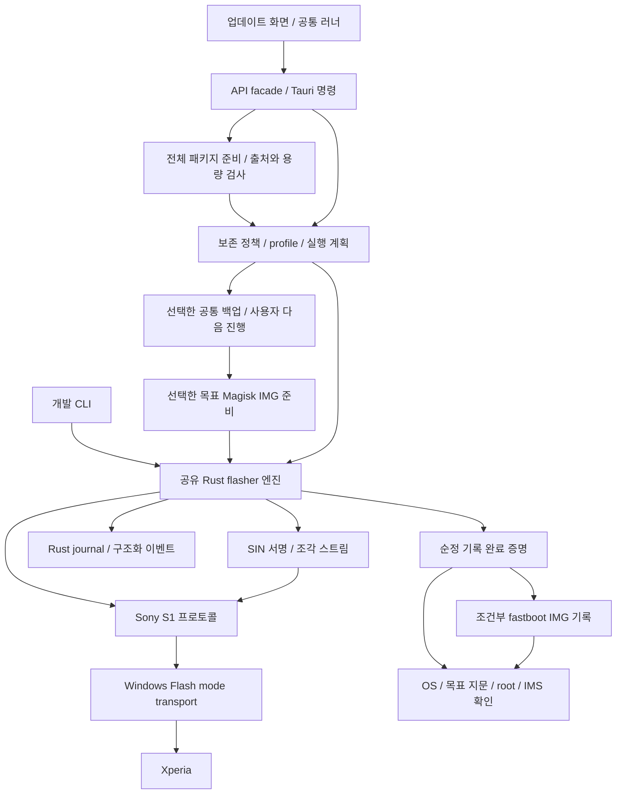

# Newflasher 기반 네이티브 펌웨어 엔진 설계

status: draft

작성일: 2026-10-08. 사용자 요청에 따른 **레퍼런스·통합·검증 계획**이다. Rust 코드, 화면, 실행 플래그는 이번에 변경하지 않는다. 전체 펌웨어 기록 엔진은 아직 미구현이다.

## 1. 목표와 범위

외부 `newflasher.exe` 실행 대신 Newflasher의 Sony Flash mode 처리 방식을 Rust 라이브러리에 이식한다. GUI와 개발 CLI가 같은 엔진을 사용한다. 콘솔 질문은 타입이 있는 정책 입력으로, 콘솔 출력은 진행 이벤트·구조화 오류·기록 증거로 바꾼다.

첫 구현 범위는 **Xperia 1 V / XQ-DQ44, 같은 지역의 순정 펌웨어, 데이터·modem/DSP 유지 업데이트**다. 출발/목표 버전 쌍은 실측 때 명시한다. 기존 VoLTE 패치 성공이나 부트 이미지 기록 성공을 이 엔진의 검증으로 대신하지 않는다.

- 순정 업데이트 자체에는 루팅·언락이 필요하지 않다. 기기가 받아들이는 Sony 순정 서명과 기종/지역/버전 조건을 확인한다.
- 업데이트 전용 경로는 언락·리락·EFS 재주입을 추가하지 않는다. 부트로더 상태 유지와 루팅 유지 선택은 별개다.
- 백업 안내·선택·백업 완료 뒤 사용자 진행은 [시작 경로 계획](workflow-modes-20261007.md)의 정책을 계승한다.
- 루팅 유지는 목표 버전 이미지 사전 패치 → 순정 SIN 업데이트 → 별도 fastboot/fastbootd IMG 기록이다. 패치 IMG를 SIN으로 변조하거나 Flash mode로 직접 보내지 않는다.
- 모뎀 포함 후 재패치, 기종/지역 전환, 다운그레이드, 파티션 재구성, 다른 OS 지원은 첫 구현 범위 밖이다. 필요한 경우 별도 계획과 검증을 추가한다.

상위 로컬 `tasks/plan.md`의 D6/M6와 기존 계약은 래퍼 설계를 설명한다. 이 문서는 그 설계를 대체할 **네이티브 구현안**이다. 실제 구현 시 구형 래퍼 설명·번들 요구·API를 함께 정리한다. 현재 코드에 래퍼가 이미 구현됐다는 뜻은 아니다.

## 2. 외부 레퍼런스와 고정 기준

### 주 레퍼런스: munjeni/newflasher

- 저장소: [munjeni/newflasher](https://github.com/munjeni/newflasher).
- 조사 기준 커밋: [`59f12e437d29f0385eb27dcebba5158aa3f97b45`](https://github.com/munjeni/newflasher/tree/59f12e437d29f0385eb27dcebba5158aa3f97b45), 2026-09-26. `version.h`는 61이다.
- 비교용 릴리스: [태그 61](https://github.com/munjeni/newflasher/releases/tag/61), 커밋 `2052e3ae16d91cc67c3b73f4d93531cf44785aa9`. 조사 기준 커밋까지의 차이는 드라이버 설치 파일·다운로더·빌드 설정이며 `newflasher.c`는 동일하다. 소스와 배포 바이너리가 같다고 자동 가정하지는 않는다.
- 기준 `newflasher.c` SHA-256: `79804a4df5a35e507a96df827083ca3eac3f70d068223ca2a70246f4ad2f9e17`.
- 이전 조사에서 언급한 v60을 최신 기준으로 계속 사용하지 않는다. 앞으로 업스트림을 갱신할 때 커밋·해시·차이·새 검증 결과를 함께 남긴다.

아래 행 번호는 위 고정 커밋 기준이다. 함수/구역 이름을 함께 사용해 추적한다.

| 참고 위치 | 확인할 동작 | 우리 구현에서 옮길 책임 |
|---|---|---|
| [`newflasher.c`: `open_dev`, Windows `transfer_bulk_async`](https://github.com/munjeni/newflasher/blob/59f12e437d29f0385eb27dcebba5158aa3f97b45/newflasher.c#L636) | SetupDi 장치 발견, 비동기 읽기/쓰기, 전송 길이와 시간 제한 | Windows Flash mode transport |
| [`get_reply`](https://github.com/munjeni/newflasher/blob/59f12e437d29f0385eb27dcebba5158aa3f97b45/newflasher.c#L1110) | 응답 경계, 명령별 텍스트/바이너리 처리 | S1 전용 프로토콜 상태 머신 |
| [`check_in_updatexml`, `process_sins`](https://github.com/munjeni/newflasher/blob/59f12e437d29f0385eb27dcebba5158aa3f97b45/newflasher.c#L1534) | NOERASE, 서명과 SIN 조각의 전송·완료 응답 | 보존 정책, SIN reader, 전송 엔진 |
| [XML callbacks / `parse_xml`](https://github.com/munjeni/newflasher/blob/59f12e437d29f0385eb27dcebba5158aa3f97b45/newflasher.c#L2137) | delivery 설정과 파일 목록 | XML 구조 검사와 계획 생성 |
| [연결 시작 / 장치 정보 조회](https://github.com/munjeni/newflasher/blob/59f12e437d29f0385eb27dcebba5158aa3f97b45/newflasher.c#L3057) | VID/PID, 장치 정보, 슬롯·보안·저장장치 조건 | identity 및 capability 검사 |
| [partition delivery 구역](https://github.com/munjeni/newflasher/blob/59f12e437d29f0385eb27dcebba5158aa3f97b45/newflasher.c#L4413) | 저장장치 조건별 파티션 처리 | 구조 변경 감지; 첫 버전에서는 차단 |
| [boot delivery 구역](https://github.com/munjeni/newflasher/blob/59f12e437d29f0385eb27dcebba5158aa3f97b45/newflasher.c#L5120) | 보안/플랫폼 조건에 맞는 부트 구성 선택 | 기종 profile·boot delivery 선택 |
| [슬롯 선택과 세션 종료 구역](https://github.com/munjeni/newflasher/blob/59f12e437d29f0385eb27dcebba5158aa3f97b45/newflasher.c#L5550) | active slot·내부 TA·재부팅 처리 | 슬롯 정책·정리·후속 모드 전환 |

MIT [LICENSE](https://github.com/munjeni/newflasher/blob/59f12e437d29f0385eb27dcebba5158aa3f97b45/LICENSE)의 저작권·허가문을 포팅한 코드와 배포 고지에 유지한다. 라이선스 고지 파일을 만들고 각 모듈의 대응 함수·커밋·의도적으로 달라진 정책을 기록한다. 저장소에 있는 드라이버 MSI의 재배포 권리는 Newflasher 소스의 MIT와 별도이므로 자동 번들하지 않는다.

### 보조 레퍼런스

| 자료 | 목적과 한계 |
|---|---|
| [Microsoft CancelIoEx](https://learn.microsoft.com/en-us/windows/win32/api/ioapiset/nf-ioapiset-cancelioex) | Windows 비동기 I/O 취소 뒤 완료를 확인하는 수명 관리. 호출 반환을 장치 쓰기 취소 완료로 해석하지 않음 |
| [AOSP metadata encryption](https://source.android.com/docs/security/features/encryption/metadata) | userdata 외 암호화 키/metadata 보존 필요성. 기종별 실제 이미지 목록은 별도 확인 |
| [Magisk 설치](https://topjohnwu.github.io/Magisk/install.html) | 같은 기기의 목표 boot/init_boot 패치와 별도 IMG 기록. 서명된 SIN 수정의 근거로 사용하지 않음 |
| [앨리자 업데이트 안내](https://cafe.naver.com/x1smart/609380) | modem/DSP/TA 제외·백업·루팅 후속 절차의 운영 근거. 모든 모델·버전의 무손실 보장이 아님 |
| [Hanabi 1 VI Android 15](https://cafe.naver.com/x1smart/606471), [Bluetooth 후속 안내](https://cafe.naver.com/x1smart/606482) | 판올림 외부 사례와 후속 문제. XQ-DQ44 검증으로 확대하지 않음 |

카페 글은 정책과 기기별 메모의 근거다. USB 명령/전송 규약은 고정된 원본 소스에서 확인한다. 블로그 명령 추측이나 다른 제조사 fastboot 동작으로 보완하지 않는다.

## 3. 내부 코드 재사용과 한계

| 현재 코드 | 재사용할 부분 | 새로 필요한 부분 |
|---|---|---|
| `src-tauri/src/firmware.rs` | Sony 배포 조회, Range/ZIP 검사, 캐시·지문 처리 | 전체 패키지 취득·용량 계산·스트리밍·manifest. 기존 256 MiB 항목 상한의 전역 완화 금지 |
| `firmware.rs::extract_sin_image` | boot IMG 추출·출처 검사 | 전체 OS용 다중 조각 SIN reader. 현재 함수는 `.001` 이후를 거부하므로 전체 플래셔로 사용 불가 |
| `fastboot/protocol.rs`, `transport.rs` | trait/FakeTransport 구조, 유한 응답 처리·시간 상한 설계 | Sony S1 세션은 별도 구현. 응답이 닮았다는 이유로 fastboot 파서를 그대로 재사용하지 않음 |
| `usbmode.rs`, `usb_driver.rs` | 장치 목록·모드 표시·드라이버 누락 안내 구조 | GordonGate 계열 연결과 Flash mode 식별. fastboot용 WinUSB 설정을 그대로 적용하지 않음 |
| `magisk/`, `boot_image.rs`, `fastboot/` | 같은 폰 패치·원본 해시·양 슬롯 기록·OS 검증 | 목표 버전 준비 계약과 순정 플래시 완료 증명 |
| `backup/`, 공통 백업 화면 | 백업 항목·권한·누락·완결 검사 | 업데이트 경로에 연결하고 완료 뒤 명시적 진행 유지 |
| `device_io.rs`, `tasks.rs`, `guard.rs` | 실행권·작업 스레드·PC 보호 | Flash mode 전송 종료까지 실행권 유지; timeout을 I/O 종료로 오인하지 않음 |
| `journal.rs`, `events.rs`, `dev_cli.rs` | 저장·진행 이벤트·GUI/CLI 공유 구조 | Rust가 기록하는 파티션/조각 단위 플래시 증거·부분 완료 |
| 프론트 `api/`, `types.ts`, `domain/plan.ts`, `stores/wizard.svelte.ts` | facade·타입·공통 계획/러너 | 전체 펌웨어 준비/검사/실행 계약과 업데이트 단계 연결 |

특히 현재 `usbmode.rs`는 Flash mode PID를 **0xADDE**로 둔다. 기준 Newflasher는 **0x0FCE:0xB00B**로 연결한다. 양쪽 모두 지원한다고 추측하지 않고 실기기 descriptor·Windows 인터페이스·드라이버·모드 전환 기록으로 확인한다. 현재 문서 작성 중 기기를 조회하지 않는다.

Windows 원본은 `CreateFile`과 OVERLAPPED `ReadFile`/`WriteFile` 경로다. 기존 `rusb` 기반 fastboot 통신으로 GordonGate 장치에 자동 연결된다고 가정하지 않는다. 첫 구현은 원본 Windows 연결 방식을 조사·포팅하며 `windows-sys`의 필요한 파일/I/O API feature를 명시적으로 추가한다. `unsafe`는 transport 안에 한정하고 핸들/이벤트/버퍼 수명을 RAII로 관리한다.

## 4. 예정 모듈 구조

아래 경로는 새로 만들 예정이며 현재 구현 파일이 아니다.

```text
src-tauri/src/flasher/
  mod.rs                  공용 엔진 API / Tauri 얇은 어댑터
  transport.rs            FlashTransport trait / 연결 조건
  transport/windows.rs    SetupDi / GordonGate 비동기 I/O
  protocol.rs             S1 명령·응답·장치 capability
  sin.rs                  CMS + 다중 SIN 조각 스트리밍 검사
  package.rs              패키지 manifest / XML / 파일 출처
  policy.rs               포함·제외·보존 판정
  profile.rs              기종·저장장치·슬롯·boot delivery 분기
  plan.rs                 검사된 실행 계획 / 계획 해시
  engine.rs               세션·전송 순서·취소 경계·종료
  journal.rs              명령 의도 / ACK / 불확정 결과 기록
  tests/                  FakeFlashTransport / 합성 패키지
```

다운로드 계층은 Sony 패키지 취득과 저장을 담당하고, flasher는 검증된 로컬 파일과 장치 정보를 받아 실행한다. XML 파서·해시·스트리밍 라이브러리는 기존 의존성을 우선 사용한다. 순정 이미지를 RAM에 통째로 올리지 않고 제한된 버퍼로 읽되, Sony 서명·조각 바이트·순서를 보존한다. 원본 C의 전역 상태·대화형 입력·광범위 기능을 통째로 옮기지 않는다.



그림의 백업·사전 패치는 선택한 경우에만 실행한다. 백업 생략·루팅 미선택 시 공통 러너가 해당 단계를 만들지 않는다. 실제 쓰기 시작 전에는 정책과 기기 식별을 재검사한다.

## 5. 펌웨어 준비와 보존 정책

1. 모델·지역·출발/목표 지문·버전·Android·현재 잠금/루트·활성 IMS 슬롯을 입력으로 고정한다. 목록 버전만으로 지역 일치를 추정하지 않는다. 정보 부족은 준비 불가 사유로 반환한다.
2. 전체 패키지 파일과 해시·크기·XML·서명/조각 목록을 manifest로 만든다. 네트워크 취득은 신뢰 가능한 배포 출처와 파일 검사를 함께 기록한다. 로컬 입력도 같은 검사를 받는다.
3. ZIP/TAR/XML의 경로 탈출·중복/대소문자 충돌·정션/링크·크기 오버플로·압축 팽창·누락을 검사한다. XML/manifest의 상대 경로는 패키지 내부로 제한한다.
4. 유지 모드는 modem/DSP, 입력 `.ta`(boot 하위 포함), userdata와 NOERASE/암호화 관련 보존 대상을 제외한다. 이름만으로 판정하지 않고 XML·SIN 내 대상·profile과 대조한다. 미분류 파일은 묵시적 허용 대신 준비 오류로 반환한다.
5. partition delivery와 실제 저장장치 조건을 대조한다. 재구성이 필요한 패키지·구조 영향 판정 불가는 첫 버전에서 차단한다. partition 폴더를 무조건 건너뛰고 호환이라고 표시하지 않는다.
6. boot delivery에서 현재 장치 조건에 맞는 구성을 고른다. 유일한 일치가 아니면 중단한다. 특정 세대의 fallback을 전체 기종에 적용하지 않는다.
7. 허용/제외 파일·이유·기록 파티션·슬롯·순서·목표 지문·profile·원본 커밋을 포함한 계획을 만든다. 원본 파일을 삭제하지 않는다. 계획을 backend 소유 ID와 해시로 묶는다.
8. 실행 전에 파일을 다시 검사하고 실행 동안 수정되지 않을 저장/핸들 정책을 적용한다. UI가 경로·허용 목록·장치 조건을 바꿔 위험 검사를 우회할 수 없어야 한다.

SHA-256과 출처 검사는 Sony 서명 검증을 대신하지 않는다. host에서 확인할 수 없는 서명 수락은 기기의 응답으로 확인하고, 거부·unknown은 실패다. 암호화 정보와 사용자 데이터를 보존해도 OS 마이그레이션·부팅 실패의 위험은 남는다. 이를 무손실 보장으로 표현하지 않는다.

## 6. 프로토콜·기종 분기와 실행 순서

- 동일 기기 재식별: ADB 시리얼과 Flash mode ID가 항상 같다고 가정하지 않는다. 모드 간 연결을 검증할 식별 정보의 대응을 조사한다. 장치 하나만 연결됐다는 이유만으로 쓰지 않고, 대응 불가·복수 후보·기기 교체는 중단한다. 공개 로그는 마스킹한다.
- 연결 후 조회로 저장장치·전송 상한·슬롯·보안·boot delivery 조건을 확인하고 profile과 대조한다. 기종별 override는 근거·허용 펌웨어 범위를 남긴다.
- S1의 텍스트 응답과 바이너리 응답을 명령별로 분리한다. partial read/write, INFO, 실패 응답, 허용 데이터 길이, 전체 deadline을 검사한다. 장치가 광고한 상한과 호스트 상한을 모두 지킨다.
- 서명 전달 방식과 조각 기록·슬롯 처리·boot delivery·세션 종료의 분기는 원본 소스에서 추적해 명시적 상태 머신으로 옮긴다. 기종별 차이를 “최신이면 동일”로 판단하지 않는다.
- 입력 TA 파일은 제외하되 플래시 세션 내부 TA 명령은 별도 allowlist로 관리한다. 각 명령의 목적·payload·실행 단계·정리 조건을 원본과 비교한다. 임의 TA 쓰기 API는 노출하지 않는다.
- 슬롯 A를 일괄 지정하지 않는다. 같은 모델이어도 active slot·양 슬롯 대상·부트 구성은 실제 장치와 검증된 profile로 결정한다.
- 순정 기록이 끝나면 종료 응답과 재부팅 경로를 기록한다. 루팅 정책이 stock이면 OS로 복귀한다. 루팅 유지면 검증된 경우에만 직접 fastboot 계열로 연계하고, 미검증이면 순정 OS 목표 지문 확인 후 기존 IMG 기록 경로를 사용한다.
- 처음부터 locked인 기기에 IMG 기록을 추가하지 않는다. unlocked 비루팅은 기본 비루팅 유지다. Magisk 이외 root manager·unknown 상태는 지원 가능한 정책을 명시하고 보존 성공으로 추정하지 않는다.

기종별 profile은 최소 `모델/지역`, `허용 source→target`, `storage/layout`, `slot 동작`, `boot delivery 선택`, `S1 signature 방식`, `종료 명령`, `root partition`, `후속 flash mode`를 구분한다. 모델명만 등록한 상태와 실측 검증을 나눈다. Android 판올림은 버전 쌍을 따로 검증한다.

## 7. 우리 프로그램에 연결할 계약안

아래 이름·타입은 **미구현 제안**이다. 구현 때 [계약 문서](../02-contracts/tauri-commands.md), facade·타입·Rust 등록·mock을 같은 변경에서 확정한다.

| 제안 계약 | 책임 | 기기 영향 |
|---|---|---|
| `firmware_package_prepare(source, deviceContext, policy)` | 전체 취득/폴더 검사, backend 준비 ID·manifest·예상 용량 반환 | PC/네트워크 I/O |
| `firmware_flash_inspect(preparedId, expectedDevice)` | Flash mode 동일 기기·capability 확인, 최종 계획 ID·허용/제외 목록 반환 | 프로토콜 조회; 실기기 검증 세션에서만 |
| `firmware_flash_run(planId, confirmation)` | 계획/기기 재검증 후 고정된 순정 계획 실행 | 쓰기 feature + 실행 capability + 위험 동의 |
| `firmware_flash_cancel(runId)` | 안전 경계에서 중단 요청; 즉시 중단 여부/대기 상태 반환 | I/O 완료 전 실행권 해제 금지 |
| `firmware_flash_status(runId)` | Rust 기록으로 준비·진행·부분 완료·재검증 필요 상태 조회 | 기록 조회 |

`expectedDevice`는 백엔드가 이전 상태와 대응 검증할 대상으로 사용한다. 프론트가 보낸 `sameDevice=true`나 rooted/unlocked boolean을 신뢰하지 않는다. `confirmation`도 검증된 계획 해시·기기·정책에 연결한다. 준비 ID를 삭제/만료/내용 변경 시 무효화한다.

기존 미구현 `fw_prepare` / `newflasher_run`은 구현 시 위 계약으로 대체하거나 호환 어댑터로 정리한다. `flasher:output` 문자열만으로 성공을 판정하지 않는다. 구조화 이벤트에는 `runId`, `planHash`, `phase`, `partition`, `slot`, `chunk`, `acknowledgedBytes`, `totalBytes`, `result/errorCode`를 포함한다. 파일 전송률과 전체 업데이트 완료를 분리한다.

프론트에는 `firmwarePackagePrepare`·`firmwareFlashInspect/Run/Cancel/Status` facade와 타입을 추가할 예정이다. 공통 러너의 `fw-download → fw-flash → fw-verify`에 연결하고 백업·목표 이미지 준비를 앞에 둔다. `fw-verify`는 재부팅 응답만으로 통과하지 않고 실제 목표 지문·루트 정책·업데이트 전 활성 슬롯의 IMS를 재확인한다. 순정 업데이트 성공/루팅 실패/IMS 미확인은 다른 결과다.

Cargo `firmware-write` 신설을 제안한다. 기본 feature `[]`와 `REAL_STEPS` 비활성은 유지한다. 일반 build/직접 invoke/CLI에서 게이트 우회가 불가능하게 한다. Flash mode probe는 쓰기 없는 기능인지 명령별 분류로 검증한다. Windows 드라이버 변경은 기존 fastboot 승인 경로를 확대 해석하지 않고 별도 설치 정책을 문서화한다.

## 8. 중단·실패·재개

- 실행 의도는 명령 직전에 Rust journal에 저장하고, 기기 ACK 뒤 완료를 별도로 저장한다. ACK 수신 후 기록 실패나 ACK 없이 연결 해제된 구간은 `unknown`으로 남긴다.
- 파티션·슬롯·SIN 해시·조각·마지막 ACK·세션 종료·stock/root 결과를 남긴다. raw TA 내용·언락 코드·IMEI·전체 시리얼은 공개 로그/계획에 저장하지 않는다.
- cancel은 지원되는 경계에서 받는다. 전송 중 OS I/O 취소 요청은 기기 내부 기록 취소를 보장하지 않는다. 실제 I/O 종료를 확인할 때까지 버퍼/핸들·기기 실행권·PC 보호를 유지한다.
- 실패한 상태 변경 명령을 자동 재시도하지 않는다. 다시 읽어도 안전한 조회와 쓰기를 구분한다. timeout wrapper만 종료하고 백그라운드 쓰기가 계속되는 설계를 금지한다.
- 재실행은 동일 기기·같은 패키지·현재 모드/슬롯·실패 지점을 재검증한다. “마지막 완료 조각 다음부터” 이어쓰기 지원은 확인 전 제공하지 않는다. journal만으로 부팅/암호화 호환성을 증명하지 않는다.
- 실행 취소·부팅 실패 뒤 자동 초기화·리락·다운그레이드·백업 삭제를 하지 않는다. 순정 성공 뒤 root 실패면 그 상태를 유지하고 준비 IMG·백업·진행 기록을 보존한다.

## 9. 구현 순서와 검증

| 순서 | 작업 | 통과 기준 |
|---|---|---|
| 1 | 기준 소스·라이선스·대응표 고정 | 커밋/해시 재현, 대응 함수·의도적 차이 기록 |
| 2 | package/SIN/XML/policy/plan 순수 로직 | 합성 다중 조각·누락·보존·경로·크기·파티션 재구성 테스트 |
| 3 | FakeFlashTransport + S1 상태 머신 | 명령/바이트 순서·ACK·partial I/O·실패/timeout 테스트 |
| 4 | 공유 journal·오류·취소·쓰기 게이트 | 연결 해제/기록 실패/중복 실행/unknown 재개를 성공으로 처리하지 않음 |
| 5 | Windows transport + CLI 검사 경로 | 오프라인 핸들 수명/취소/전송 오류 검증; 실제 연결은 별도 세션 |
| 6 | 전체 취득·facade·업데이트 UI/백업/목표 패치 연결 | 공통 러너와 기존 현재 지문 게이트 유지, 타입/계획/모의 IPC 검증 |
| 7 | 실기기 probe → 제한한 모델/버전 쓰기 | 아래 실측 항목 기록 후 해당 조합만 배포 활성화 검토 |
| 8 | root 유지·다른 모델·판올림 확장 | 각 조합을 별도 검증하고 profile/기기 문서 갱신 |

차등 검증은 **고정 C 소스의 전송 함수를 테스트용 fake로 교체한 오프라인 harness**와 Rust FakeFlashTransport의 명령/바이트 transcript를 비교하는 방식으로 준비한다. 원본 CLI에 공식 dry-run이 있다고 가정하지 않는다. harness의 소스 변경도 기록하고 USB를 열지 못하게 한다. 플래시 핵심 순서/응답 비교와 우리 보존 정책의 의도적 차이는 구분한다. 원본도 입력을 잘못 처리하면 Rust까지 같은 성공으로 만들지 않는다.

합성 fixtures는 서명 수락을 fake하는 테스트용이며 실제 기기 쓰기에는 사용할 수 없다. Sony 펌웨어를 공개 fixture로 재배포하지 않는다. 로컬 실제 패키지 검사는 별도 opt-in으로 수행하고 출처/해시·크기·비식별 요약만 남긴다.

오프라인 필수 사례:

- 다중 `.000/.001/...` 순서·서명·잘린 조각·중복/역순, 압축/해제 길이와 overflow.
- NOERASE/XML 대소문자·구조 변형·누락, metadata/암호화 관련 unknown, modem/DSP/TA/userdata가 허용 목록에 남는 경우 차단.
- boot delivery 0개/복수 일치, 알 수 없는 저장장치/슬롯/전송 상한, PID 감지와 identity 불일치.
- short read/write·INFO 폭주·FAIL·서명 거부·disconnect·ACK 전/후 저장 실패·cancel 대기·동시 ADB/DIAG 요청.
- locked stock / unlocked stock / Magisk 유지 / root unknown, 순정 성공 뒤 IMG 기록 실패, 생략 백업·불완전 백업·백업 뒤 대기/재개.
- 기본 build와 쓰기 feature build 모두 미승인 쓰기·직접 invoke를 차단하는지 검사.

실기기 항목은 구현 때 기존 `device-test-checklist.md`에 추가한다. 현재 수정 중인 체크리스트를 이 문서 작업에서 변경하지 않는다.

실측에는 모델/지역·출발→목표 지문/Android·Windows 드라이버·USB descriptor·잠금/root·active slot·백업 선택·제외 목록·기록 ACK·재부팅 결과를 남긴다. 데이터 접근/대표 앱·사진·문서, root 정책, SIM별 IMS·실제 통화, Bluetooth 등 기종별 후속 기능을 따로 확인한다. 대표 데이터 확인을 전체 무손실 증명으로 표현하지 않는다.

## 10. 구현 완료 시 문서 동기화

- `.plans/02-contracts/tauri-commands.md`: 위 계약·이벤트·오류·취소와 미구현 래퍼 정리.
- `.plans/01-views/*`, `03-data/mock-schema.md`: 변경 화면·상태·mock·버튼 매핑.
- `.plans/04-engine/workflow-modes-20261007.md`: 실제 단계와 엔진 준비 상태.
- `.plans/04-engine/device-test-checklist.md`: 모델/버전 조합과 native transport 실측 항목.
- `docs/structure/overview.md`, `firmware.md`, `state-recovery.md`, `root-unroot.md`: 실제 책임·데이터/부트 정책·부분 완료.
- `docs/devices.md`, `README.md`: 검증된 조합과 범위. 미검증 모델을 완료 기기로 표시하지 않음.
- 라이선스 고지·upstream 대응표·배포 구성과 상위 로컬 구형 D6/M6 계획: 네이티브 방식에 맞게 정리.

이번 작성으로 구현 완료나 기기 쓰기 승인이 추가되지는 않는다. 실제 구현·배포 활성화는 위 순서와 기존 실행 게이트를 따른다.
