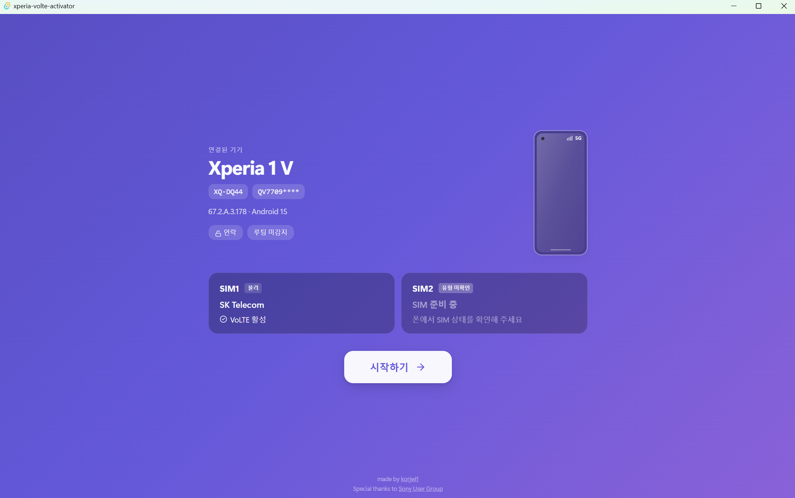
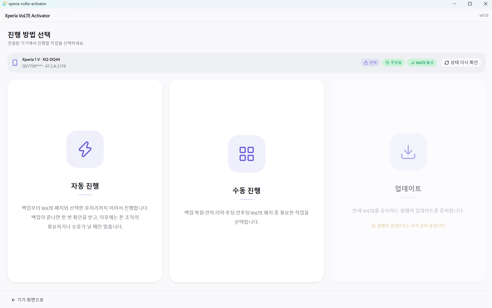
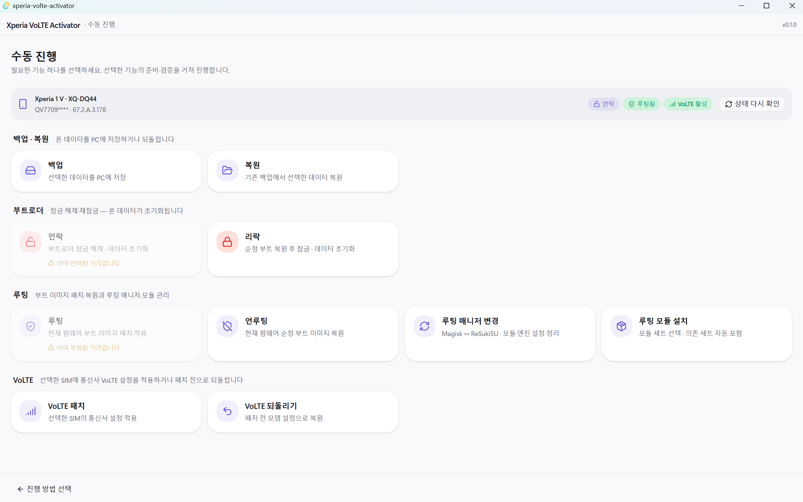

<h1 align="center">Xperia VoLTE Activator</h1>

  <b>Sony Xperia의 백업부터 루팅과 VoLTE 패치까지</b> 
  백업, 부트로더 작업, 루팅과 VoLTE 패치를 연결하는 Windows용 개발 중 도구입니다.

  Tauri 2 · Svelte 5 · TypeScript · Rust — ADB와 EFS/NV는 Rust 엔진을 사용합니다.

  
  
  
  

  
   
  Xperia의 푸른 웨이브와 XDA에서 영감을 받은 주황빛 신호.

---

## 목차

- [화면](#화면)
- [호환성 검증](#호환성-검증)
- [주의 사항](#주의-사항)
- [문서](#문서)

---

## 화면

**기기 연결** — 연결된 Xperia와 펌웨어, 부트로더·루팅 상태, SIM별 VoLTE 상태를 확인합니다.

  

**진행 방법 선택** — 자동 진행, 수동 진행, 업데이트를 선택합니다.

  

**수동 진행** — 필요한 기능을 선택하며, 기기 조건에 맞지 않는 기능은 비활성화됩니다.

  

---

## 호환성 검증

전체 GUI 절차의 호환성 테스트가 끝난 기기는 아직 없습니다. 다음 환경에서는 일부 단계의 실기기 동작을 확인했습니다.

| 기기 | 확인 환경 | 검증된 범위 |
|---|---|---|
| Xperia 1 V JP · **XQ-DQ44** | 펌웨어 **67.2.A.3.178**, SIM1 **SKT**, SIM2 없음 | 백업, 언락, Magisk 30.7 루팅(개발 CLI)·EFS 적용·IMS 등록 및 사용자 VoLTE 발신/수신, 복원(DCIM 제외), 언루팅(GUI) |

같은 기종의 다른 지역판·펌웨어·통신사까지 검증한 것은 아닙니다. 리락·펌웨어 업데이트·ReSukiSU 루팅·루팅 도구 및 전체 GUI 연속 실행은 추가 확인이 필요하며, 이 기능들은 기본 빌드에서 꺼져 있습니다. 정확한 기록과 다른 기기의 상태는 [기기별 메모](docs/devices.md)를 참조하세요.

---

## 주의 사항

- 언락·리락은 기기 데이터를 초기화할 수 있습니다. 기록·복원·EFS 수정 실패는 부팅이나 통신에 영향을 줄 수 있습니다.
- 앱 데이터의 일부는 Android 권한 때문에 백업·복구할 수 없습니다. 백업 완료가 모든 앱의 완전한 복원을 보장하지 않습니다.
- 기본 GUI 실행은 시뮬레이션이고 쓰기 Cargo feature는 기본 비활성입니다. 개발 CLI에서 확인한 결과가 일반 빌드의 전체 동작을 보장하지 않습니다.
- 시작하기 뒤 자동/수동/업데이트를 선택합니다. 새 버전 선택은 VoLTE가 인식되는 기기의 전용 Newflasher 업데이트 경로에만 있습니다. 안내·백업 선택은 구현됐지만 전체 펌웨어 기록은 아직 실행할 수 없습니다.
- 수동 루팅 매니저 변경·모듈 세트 설치, 자동 루팅 유지 시의 세트 선택을 제공합니다. 새 기능은 실기기 미검증이며 기본 설치/기록은 비활성입니다. HMA는 카페 프리셋 그대로, OverlayFS는 공식 GitHub에서 받습니다. [동봉 파일 출처](src-tauri/assets/root/README.md) · [루트 도구](docs/structure/root-tools.md).

- EFS 리드백 일치, IMS 등록, 실제 통화 성공은 서로 다른 확인입니다. 로밍·MMS·장기간 안정성은 별도 검증이 필요합니다.
- 기기 백업·모뎀 설정에는 개인정보가 포함될 수 있습니다. 원본 백업이나 인증 정보는 공개 저장소에 올리지 마세요.

---

## 문서

| 문서 | 내용 |
|---|---|
| [시스템 구조와 기능별 동작](docs/structure/overview.md) | 앱 구조, 기능별 동작과 실행 흐름 |
| [개발/검증 방법](docs/structure/development.md) | 개발 환경, 빌드와 검증 방법 |
| [기기별 메모](docs/devices.md) | 기기별 검증 환경과 결과 |
| [문서 목록](docs/README.md) | 전체 문서 안내 |
| [기여 시 작업 규칙](AGENTS.md) | 코드와 문서 변경 규칙 |
