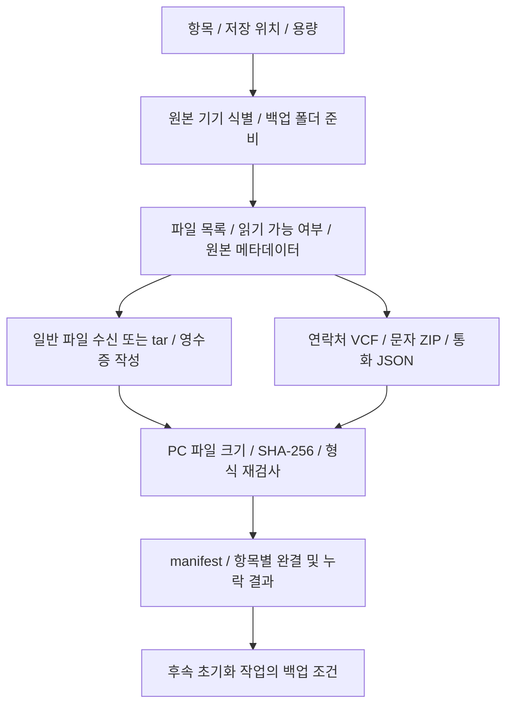

# 백업과 복구

기준일: 2026-10-08. 담당: `src-tauri/src/backup/`, 공통 `device_io.rs`·`storage.rs`, 위자드 백업/복구 러너.

## 백업 처리

대표 모듈: `walker`는 원격 목록, `puller`는 파일 수신, `runner`는 항목 실행, `model`은 manifest/영수증, `verify`는 PC 검증, `source_metadata`는 원본 속성, `quarantine`/`winname`은 Windows에서 표현하기 어려운 이름을 처리합니다.

- 원격 경로·Windows 금지 문자·대소문자 충돌을 검사합니다. 표현 불가능한 파일은 대응 기록이 있는 격리 경로로 보존합니다.
- 파일을 임시 위치에 받고 검증 후 확정합니다. 재개가 실패해도 기존 검증된 사본을 먼저 파괴하지 않습니다.
- 크기/해시뿐 아니라 원본 mtime 등 지원되는 속성과 수집 시점을 기록합니다. 원래 없거나 조회할 수 없던 속성을 복원 가능하다고 주장하지 않습니다.
- PC 검증은 제한된 병렬 해시 작업을 사용합니다. 전송 성능과 저장소/캐시 기반 검사 성능은 별개의 값입니다.
- 파일별 영수증이 있어도 파일 변경·손상·원본 시각 미확인이 발견되면 다시 전송/검증합니다. 원본에서 사라진 파일의 기존 성공 사본은 보존합니다.

## 앱·설정·연락처·문자

| 종류 | 처리 | 제한 |
|---|---|---|
| 공유 저장소 | 일반 파일 수신, 목록·크기·해시 | 읽기 권한 및 기기 연결 필요 |
| 앱 APK/데이터 | APK 목록·split 정보, 읽을 수 있는 데이터 보관 | Android 권한·앱 자체 보호 때문에 전체 데이터 복원 보장 불가 |
| 설정 | 허용 목록 기반 수집·복원 | 모든 시스템 설정/계정/인증서를 복원하지 않음 |
| 연락처 | VCF 보관, 가져오기 결과 확인 | 현재 별도 연락처 JSON 보관은 제거됨 |
| 문자·통화 | SMS Import/Export의 날짜 ZIP/JSON 수집 | 사용자가 폰 앱에서 내보내기/가져오기, 작성 중 파일은 완결로 인정하지 않음 |

백업 파일 읽기와 별개로 문자 준비 과정은 APK 설치·권한·임시 폴더 등 폰 작업을 포함합니다. 문자 산출물은 사용자의 완료 확인, ZIP CRC/JSON 검사, PC 저장/manifest 확인 후 임시 사본을 처리합니다.

## 완결과 제외

원본 Permission denied를 빈 폴더나 성공으로 처리하지 않습니다. `access_diagnostics`가 shell UID·부모/파일 권한 등을 검사해 안내 근거를 만듭니다. 읽기 권한 자체를 자동 변경하지 않습니다.

사용자가 읽을 수 없는 앱 데이터의 제외를 선택하면 `omissions`가 제외 범위·이유를 기록하고 해당 PC 사본 정리를 수행합니다. 제외 후 `complete=true`는 **현재 보관하기로 한 범위**의 완결입니다. 원본 전체가 백업됐다는 뜻이 아닙니다. 초기화 전 게이트는 원본 기기와 완결/명시적 누락 수용 정책을 재검사합니다.

## 복구 처리

1. 백업 폴더/manifest·원본 기기·경로·해시를 검사하고 복원 항목을 확정합니다.
2. APK/split APK를 필요한 경우 설치합니다. 설치 세션 실패는 abandon 처리합니다.
3. 검증한 일반 파일/tar·격리 대응표를 사용해 복원합니다. tar 경로 이탈·손상 입력은 거부합니다.
4. 허용한 설정을 복원하고 연락처/문자/통화 가져오기 안내·원래 역할 복원을 수행합니다.
5. 자동 처리와 사용자 수동 가져오기의 결과를 구분합니다. 읽기 검증 성공을 실제 복원 성공으로 표시하지 않습니다.

현재 통합 계획은 초기화가 포함되고 백업을 선택했을 때 복구를 넣습니다. [수동 복구 분리](workflow.md)는 계획 단계입니다. 복구 엔진은 오프라인 테스트를 통과했지만 초기화 후 전체 실기기 복원 검증은 완료되지 않았습니다.

백업 삭제는 앱이 만든 유효 manifest 폴더에만 적용하고 명시적 사용자 확인을 요구합니다. 사용자가 선택한 상위 저장 위치 전체를 삭제하지 않습니다. 기기별 대용량 실측과 예외는 [기기별 메모](../devices.md)에 기록합니다.

## 예정: 업데이트의 백업 선택

업데이트도 안내·동의 후 자동 진행과 같은 `BackupSelectView`의 항목·저장 위치·공간·권한/누락 안내와 공통 엔진을 사용할 계획입니다. 비루팅에서 수집할 수 없는 앱 데이터를 백업하기 위해 언락·루팅을 강제하지 않습니다. 백업 선택은 유지하고 생략 시 계획에 그 선택과 별도 백업 필요성을 표시합니다.

선택한 백업의 완결/누락 검사 후 사용자 [다음 과정 진행]을 기다린 뒤에만 사전 루팅 이미지 패치·펌웨어 기록으로 넘어갑니다. 백업 생략이면 이 대기를 만들지 않습니다. 새 백업/기기 변경·재개가 기존 승인을 자동 승계하지 않게 합니다. 정상 업데이트 뒤 자동 복구로 기존 데이터를 덮어쓰지 않고, 오류 후에도 백업을 자동 삭제하거나 폰을 초기화하지 않습니다. 이 화면 연결은 [분기 계획](../../.plans/04-engine/workflow-modes-20261007.md)의 미구현 항목입니다.

## 2026-10-08 ?? ?? ??

?? ??? ??? ?? ??? ????? ?????. ?? ??? manifest ???????? ?? ???? ?? ??? ?????. ?? ?? ??? ?? ??? ?? ??? ???? ????? ??? ????. ?? ??? ?? ?? ???? ??? ???? ????. ?? ??? ??? ?? ??? ??? ???? ?????? ?? ??? ?? ????. ??? ?? ??? ???? ?? ??? ?????.
