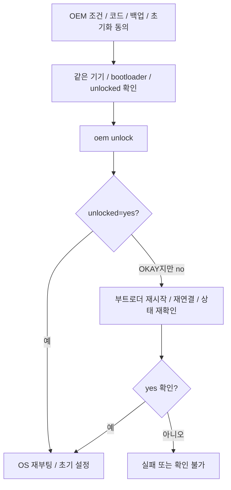
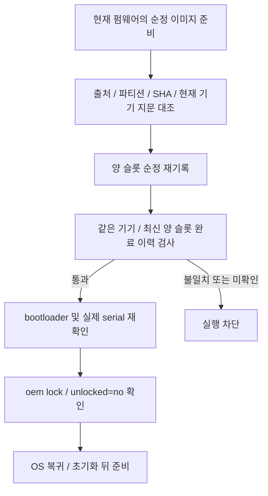

# 부트로더와 파티션 기록

기준일: 2026-10-07. 담당: `src-tauri/src/fastboot/{mod,protocol,transport,relock}.rs`, `boot_image.rs`, `usb_driver.rs`.

## 명령과 모드

fastboot 전송은 자체 `rusb`/프로토콜 구현을 사용합니다. DATA/INFO/OKAY/FAIL을 제한된 길이·횟수·시간 안에서 해석합니다. GUI와 CLI는 동일한 기록/검증 함수를 호출합니다.

| 작업 | 요구 모드 |
|---|---|
| 언락·리락 | bootloader, `is-userspace=no` |
| `init_boot` 기록 | fastbootd로 전환하고 `is-userspace=yes` 확인 |
| `boot` 기록 | 현재 공통 기록 함수도 fastbootd 확인 후 수행. `boot` 기종 실측은 별도 필요 |

슬롯 지원은 `has-slot` 또는 해당 모드에서 제공하는 슬롯별 파티션 크기로 확인합니다. XQ-DQ44의 부트로더가 `has-slot:init_boot`를 제공하지 않는 사례 때문에 변수 미제공을 곧바로 슬롯 없음으로 판단하지 않습니다.

## 언락

`OKAY`만으로 언락 성공을 선언하지 않습니다. XQ-DQ44에서는 명령 직후 `unlocked=no`, 부트로더 재시작 후 `yes`가 관찰됐습니다. 이 재확인은 언락 명령을 재전송하는 동작이 아닙니다. 후속 수정의 GUI 전체 재실행은 별도 검증 대상입니다.

## 이미지 기록

이미지의 헤더/종류·크기·SHA-256·순정 추출 출처·현재 기기 지문 대조 기록을 먼저 확인합니다. 전송 대상 기기 serial과 기대 serial이 맞아야 하고 동일하게 검사한 버퍼를 기록합니다. `init_boot`와 `boot`를 바꿔 전달하면 USB 기록 전에 거부합니다.

양 슬롯 `_a`/`_b`를 순서대로 기록하고 각 슬롯의 `started/done/failed`를 저장합니다. 일부 슬롯 실패 시 전체 성공으로 처리하지 않으며 자동 순정 롤백을 보장하지 않습니다. 중단 시 결과가 불명한 쓰기를 자동 재전송하지 않습니다.

## 조건부 리락

리락은 단순히 su가 안 보인다고 허용하지 않습니다. 순정 출처·해시·현재 펌웨어와 양 슬롯 최신 완료 이력이 필요합니다. 손상 이력, 다른 기기, 이후 실패/미완료 기록은 차단합니다. 이력 보관만으로 자동 잠금이 허용되지 않습니다.

이 게이트는 앱이 관찰한 부트 복원 조건을 확인합니다. 전체 AVB 체인, rollback index, 외부 모뎀·커널·vbmeta 변경이나 실제 파티션 전체 리드백을 인증하는 기능은 아닙니다. 리락 실기기 검증 범위는 [기기별 메모](../devices.md)를 참조합니다.
