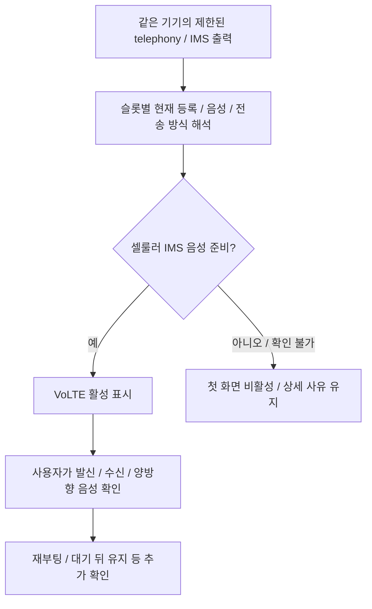

# 통신 상태와 VoLTE 확인

기준일: 2026-10-07. 담당: `src-tauri/src/ims.rs`, `adb.rs`, `src/lib/domain/communication.ts`, 위자드 통신 상태, `CommunicationPanel.svelte`.

## 판정 과정

`cellularReady(sim)`은 상세 진단이 있으면 `status=registered`, `registration=registered`, `voice=true`, `transport=cellular`를 모두 요구합니다. 구형 응답에 상세 진단이 없으면 `volte=on` 요약을 사용합니다. 음성 기능만 true이거나 과거 등록 로그가 있다고 활성으로 판정하지 않습니다.

## 구분하는 상태

| 상황 | 처리 |
|---|---|
| 셀룰러 IMS 등록 + 음성 사용 가능 | VoLTE 활성/셀룰러 IMS 음성 준비 |
| Wi-Fi 등록, cross-SIM, LTE/NR 외 망, 전송 방식 미확인 | 세부 사유를 분리, 셀룰러 VoLTE 활성으로 합치지 않음 |
| SIM 없음·잠김·미준비 | SIM 상태와 함께 표시 |
| 등록 중·미등록·음성 불가 | 등록/음성 상태를 분리 |
| 조회 실패·미지원 형식·모순된 증거 | 확인 불가, 성공으로 치환하지 않음 |

첫 화면과 사이드바는 현재 사용자 결정에 따라 VoLTE 활성/비활성만 표시합니다. 상세 진단은 통신 확인 패널에서 등록·음성·SMS·망·기술을 나눠 표시합니다. 기술이 확인되지 않으면 LTE라고 추측하지 않습니다. NR 등록 관찰을 별도의 VoNR 실기기 테스트 완료로 승격하지 않습니다.

`adb.rs`는 대용량 dumpsys를 셸 변수의 printf 인자로 넘기지 않고 파이프로 필요한 줄을 추립니다. 종료 코드/줄 시작의 dumpsys 오류를 검사해 일반 로그 속 Exception을 조회 실패로 오판하지 않습니다. 이 차이는 XQ-DQ44에서 읽기 진단으로 확인됐습니다.

## 기록과 실제 통화

통신 스냅샷에는 펌웨어/지문/baseband, 슬롯별 상태, 선택 프리셋과 검사 시점을 저장합니다. 원시 dumpsys·가입자 식별자·전화번호를 저장하지 않습니다. 조회 세대·기기·SIM 선택이 달라진 뒤 도착한 결과는 버립니다. 기기/SIM/펌웨어 변경 시 예전 통화 확인을 새 상태에 재사용하지 않습니다.

현재 통화 확인은 슬롯별 발신 연결, 다른 전화에서 수신, 양쪽 음성 전달을 사용자가 확인합니다. 재부팅 후·대기 후 유지 확인은 추가 증거입니다. 앱이 자동 발신하거나 문자/SMS·APN을 변경하지 않습니다.

EFS 리드백, persist 속성 설정, IMS 등록, 실제 통화는 다른 결과입니다. SMS/MMS·5G 데이터·해외 로밍·유심 교체·장기간 안정성은 각각 별도 실기기 기록이 필요합니다. [VoLTE 패치](volte.md)와 [기기별 검증](../devices.md)을 함께 확인하세요.
