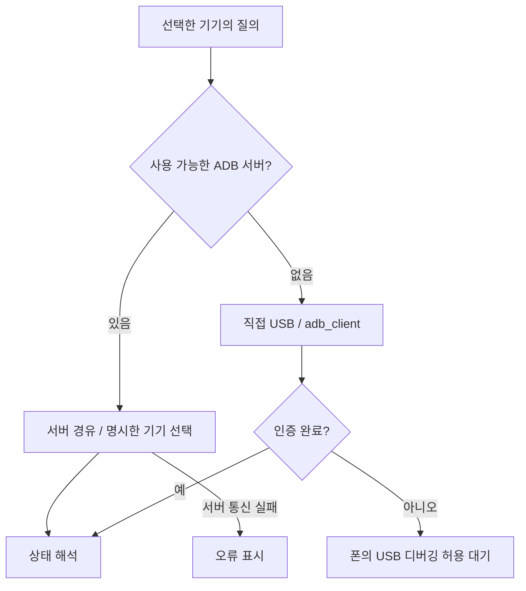

# 기기 감지와 연결

기준일: 2026-10-07. 담당: `adb.rs`, `ims.rs`, `usbmode.rs`, `usb_driver.rs`, `device_io.rs`, `vendor/adb_client`와 프론트 `data/devices.ts`.

## ADB 연결

서버 오류를 숨기면서 직접 USB로 변경하지 않습니다. 직접 연결에서는 기존 `~/.android/adbkey`가 있으면 사용하고 없으면 앱 데이터에 인증 키를 만듭니다. 키 자체는 로그나 공개 문서에 넣지 않습니다.

기기 상태에는 모델, 펌웨어/지문, Android, 부트로더, 루트, SIM·IMS, USB 상태가 포함됩니다. 기기 화면은 폴링하되 앞선 조회가 진행 중이면 겹치지 않습니다. 작업 시작 시 대상 기기를 고정하고 다른 기기/옛 화면의 늦은 응답을 버립니다.

## 서로 다른 USB 경로

| 모드 | 용도 | 확인/전송 |
|---|---|---|
| Android / ADB | 상태, 백업/복구, Magisk 스테이징, DIAG 전환 | ADB 서버 또는 직접 USB |
| bootloader-fastboot | 언락·리락, 부트로더 변수 | rusb, `is-userspace=no` 확인 |
| fastbootd | 현재 `init_boot` 기록 경로 | rusb, `is-userspace=yes` 확인 |
| Sony flashmode | 전체 순정 펌웨어 기록의 예정 경로 | newflasher 영역, 실제 업데이트 엔진 미구현 |
| Qualcomm DIAG COM | EFS/NV 읽기·쓰기 | 명시적 COM, serialport/HDLC |

폰이 한 모드에서 보인다고 다른 모드의 드라이버까지 준비됐다고 판단하지 않습니다. fastbootd의 `18D1:4EE0`도 코드에서 인식합니다. Windows의 fastboot 드라이버가 없으면 `usb_driver.rs`가 기종별 Sony 공식 패키지와 INF를 지정하며 UAC 허용이 필요합니다. 일반 환경 진단은 DIAG 드라이버를 자동 설치하지 않습니다.

## 모델·루트·SIM 판정

- 부트 파티션은 모델 접두사 표로만 고릅니다. OS를 Android 13 이상으로 업데이트했다는 이유로 `boot`를 `init_boot`로 바꾸지 않습니다. 표 밖 모델은 추측하지 않습니다.
- 루트는 확인됨/없음/확인 불가를 구분합니다. su 권한 거부를 순정 상태로 간주하지 않습니다. Magisk의 su가 PATH에 없으면 `/debug_ramdisk/su`를 사용하는 공통 명령을 적용합니다.
- 물리 SIM/eSIM은 구독 정보의 `isEmbedded`로 판정합니다. 빈 슬롯이나 두 번째 슬롯을 eSIM이라고 가정하지 않습니다. 기기가 보고한 슬롯 용량을 사용합니다.
- 첫 화면의 VoLTE 활성은 셀룰러 IMS 음성 등록 판정입니다. 원시 진단의 unknown/실패 사유는 내부·상세 패널에 남습니다. 상세 설명은 [통신 확인](communication.md)을 참조합니다.
- DIAG 전환은 기종별 조건을 갖습니다. 1 IV/5 IV는 `persist.usb.eng=1` 설정·리드백 뒤 개방합니다. 여러 Qualcomm 포트 중 사용할 COM은 사용자가 명시하며 한 PC의 번호를 다른 기기에 재사용하지 않습니다.

직접 USB와 서버 소켓에는 I/O 상한이 있습니다. 패치 내용·재연결/전송 세부 변경은 [vendor PATCHES](../../src-tauri/vendor/adb_client/PATCHES.md)에 남깁니다. 기종별 사례는 [기기별 메모](../devices.md)에서 관리합니다.
