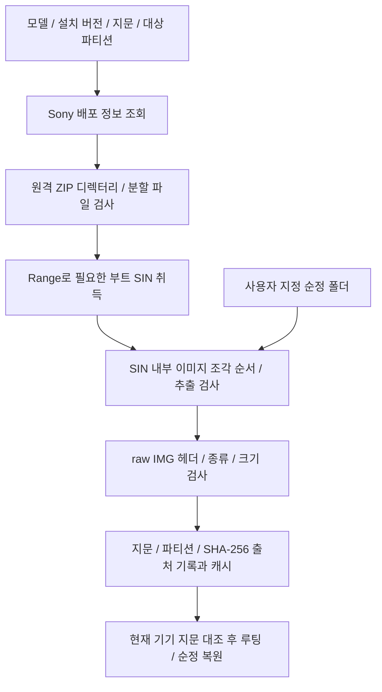

# 펌웨어 취득과 업데이트

기준일: 2026-10-07. 담당: `firmware.rs`, `boot_image.rs`, 프론트 `firmwareVersions/firmwareFetch/firmwareDirCheck`와 계획 생성.

## 구현됨: 순정 부트 이미지 준비

`firmware_fetch`는 전체 OS를 설치하는 API가 아닙니다. 순정 `boot/init_boot`만 부분 다운로드합니다. 서버 목록의 목표 버전과 기기의 실제 지문을 대조해 다른 지역/버전 이미지를 무심코 기록하지 않게 합니다. 원격 ZIP/ZIP64 디렉터리, 분할 조각, Range 응답과 읽기 상한을 검사합니다.

직접 지정한 폴더도 `update.xml`의 지문과 유일한 대상 SIN이 필요합니다. 여러 후보나 잘린 조각을 임의 선택하지 않습니다. 추출 후 `<이미지>.json`에 파티션·지문·해시 출처를 저장하고 `boot_image_check`에서 현재 기기와 대조합니다. `ANDROID!` 매직만으로 순정·AVB 인증이 완료됐다고 하지 않습니다.

파티션은 모델 표로 고릅니다. `init_boot`는 대응 헤더/커널 구성, `boot`는 그 종류에 맞는 구성·크기를 검사합니다. 상세 모델 표는 [기기 문서](../devices.md)를 참조합니다.

## 미구현: 전체 펌웨어 기록

현재 UI 계획에는 전체 펌웨어 다운로드 → 기록 → 버전/지문 확인 단계가 있으나 전체 다운로드·스테이징·newflasher 실행 엔진은 연결되지 않았습니다. `liveStepEnabled("fw-flash")=false`이며 실전 계획은 시작 전에 거부합니다. 펌웨어 취득 화면이나 버전 목록이 있다고 실제 OS 업데이트가 가능한 것은 아닙니다.

현재 계획과 예정 업데이트 전용 경로는 두 정책을 구분합니다.

| 정책 | 포함/제외 | 후속 작업 |
|---|---|---|
| 기존 패치 유지 | modem/DSP/TA/userdata 제외, 사용자 데이터 유지 | 언락·리락·EFS 재주입 생략. 기존 루팅 유지 선택 시 새 이미지로 재적용 |
| 모뎀 포함 후 재패치 | modem/DSP 포함, TA/userdata 제외 | 필요한 언락·루팅·EFS 재적용. 언락/리락에서 초기화 가능 |

Newflasher 경로의 목적은 필요한 파티션을 제한해 기존 모뎀 설정과 사용자 데이터를 보존하는 것입니다. 모뎀을 제외하면 DSP도 함께 제외하는 정책입니다. 일반 OTA와 동일한 모든 구성 요소의 최신화는 아닙니다. 제외한 모뎀/DSP의 수정·보안 변경은 적용되지 않고 기종/버전 호환성을 별도 확인해야 합니다.

예정 구현은 원본 파일 삭제 대신 별도 스테이징 허용 목록을 사용합니다. 모델·지역·목표 지문, newflasher 버전/프롬프트, userdata 유지, 출력·종료·기기 연결 및 OS 복귀를 검사해야 합니다. 기기 상태 확인 없이 슬롯 A를 일괄 강제 지정하지 않습니다.

사용자 요청의 3번 업데이트는 VoLTE가 현재 인식될 때만 활성화하고 유지 정책을 고정할 계획입니다. [분기 설명](workflow.md)과 [구현 계획](../../.plans/04-engine/workflow-modes-20261007.md)을 참조하세요. 유지 정책이 실제 플래시 검증을 마쳤다고 표시하지 않습니다.
