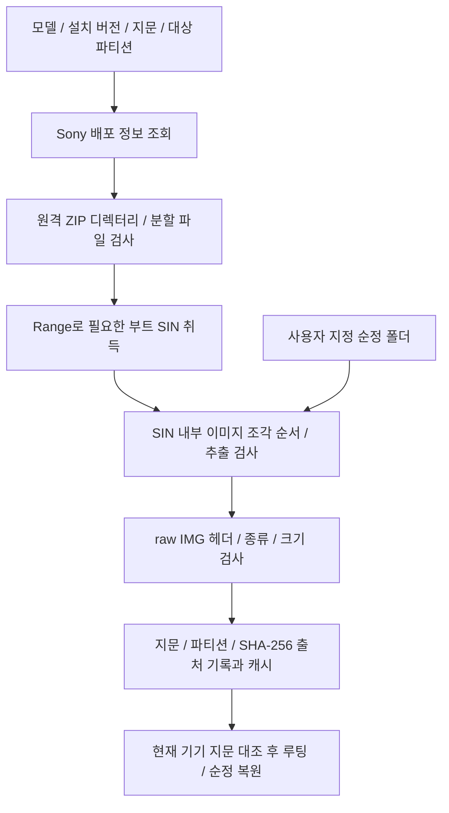
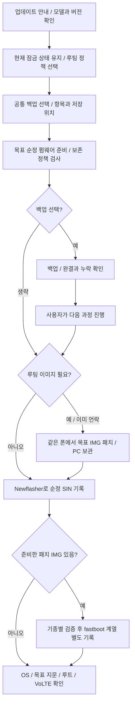

# 펌웨어 취득과 업데이트

기준일: 2026-10-08 (main 통합). 담당: `firmware.rs`, `boot_image.rs`, `flasher/`, 프론트 펌웨어 facade와 계획 생성. 업데이트 안내·백업 선택은 구현됐고 전체 기록·목표 IMG 사전 패치 연결은 계획입니다.

## 구현됨: 순정 부트 이미지 준비

`firmware_fetch`는 전체 OS를 설치하는 API가 아닙니다. 순정 `boot/init_boot`만 부분 다운로드합니다. 서버 목록의 목표 버전과 기기의 실제 지문을 대조해 다른 지역/버전 이미지를 무심코 기록하지 않게 합니다. 원격 ZIP/ZIP64 디렉터리, 분할 조각, Range 응답과 읽기 상한을 검사합니다.

직접 지정한 폴더도 `update.xml`의 지문과 유일한 대상 SIN이 필요합니다. 여러 후보나 잘린 조각을 임의 선택하지 않습니다. 추출 후 `<이미지>.json`에 파티션·지문·해시 출처를 저장하고 `boot_image_check`에서 현재 기기와 대조합니다. `ANDROID!` 매직만으로 순정·AVB 인증이 완료됐다고 하지 않습니다.

파티션은 모델 표로 고릅니다. `init_boot`는 대응 헤더/커널 구성, `boot`는 그 종류에 맞는 구성·크기를 검사합니다. 상세 모델 표는 [기기 문서](../devices.md)를 참조합니다.

## 구현됨: 로컬 전체 패키지 검사와 오프라인 코어

`firmware_package_inspect(dir, targetFingerprint)` / `api.firmwarePackageInspect`는 PC의 순정 펌웨어 폴더를 읽어 XML 지문/NOERASE·파일 해시·raw/gzip SIN 서명/조각·보존 결정을 검사합니다. 원본 파일을 수정/삭제/추출하지 않고 기기나 네트워크에 연결하지 않습니다. 개발 CLI도 같은 API를 사용합니다. 브라우저에서는 검사 성공을 mock으로 만들지 않습니다.

검사 결과는 후보/include, 보존/preserve, 미지원/block과 이유, 파일·멤버 해시, manifest 해시, blocker를 포함합니다. **`writeReady=false`가 항상 반환됩니다.** 모델·지역·같은 기기·슬롯·layout·boot delivery는 아직 검증하지 않으며, targetFingerprint는 요청한 대상과 파일 메타데이터의 일치입니다. 이 report를 실행 계획이나 쓰기 권한으로 사용하지 않습니다.

`flasher/sin.rs`는 기존 부트 추출기와 별도로 여러 SIN 조각을 스트리밍 검사합니다. `protocol.rs`와 `engine.rs`는 S1 서명·조각 다운로드·erase/flash·세션 종료/Sync, intent/ACK 기록·취소 경계를 구현했습니다. Windows transport도 작성/컴파일했지만 현재 하드웨어 진입점은 없습니다. 전송 동작은 가짜 장치와 고정 C 함수의 테스트 harness로 비교했습니다. [구현·검증·남은 통합 범위](../../.plans/04-engine/newflasher-native-progress.md)를 참조하세요.

## 미연결: 실제 업데이트 실행

현재 UI 계획에는 전체 펌웨어 다운로드 → 기록 → 버전/지문 확인 단계가 있으나 전체 다운로드·스테이징·플래시 엔진은 연결되지 않았습니다. `liveStepEnabled("fw-flash")=false`이며 실전 계획은 시작 전에 거부합니다. 펌웨어 취득 화면이나 버전 목록이 있다고 실제 OS 업데이트가 가능한 것은 아닙니다.

새 버전 조회·선택은 VoLTE 인식 기기의 전용 Newflasher 업데이트에만 있습니다. 자동/수동은 현재 설치 버전의 boot/init_boot를 준비하며 모뎀 포함 재패치 업데이트를 동시에 하지 않습니다. 전용 계획은 모뎀/DSP/TA/사용자 데이터 보존을 목표로 하고 언락·리락·EFS 재주입·자동 복구를 추가하지 않습니다.

Newflasher 경로의 목적은 필요한 파티션을 제한해 기존 모뎀 설정과 사용자 데이터를 보존하는 것입니다. 모뎀을 제외하면 DSP도 함께 제외하는 정책입니다. 일반 OTA와 동일한 모든 구성 요소의 최신화는 아닙니다. 제외한 모뎀/DSP의 수정·보안 변경은 적용되지 않고 기종/버전 호환성을 별도 확인해야 합니다.

데이터 보존은 무손실 보장이 아닙니다. 고정 소스의 데이터 유지 동작을 네이티브 정책으로 옮기고 `update.xml`의 `NOERASE`, metadata 등 암호화 관련 보존 대상, 파티션 구조 영향을 실행 전에 검사할 계획입니다. userdata 파일만 제외한 것으로 검사를 끝내지 않습니다. [Newflasher 구현](https://github.com/munjeni/newflasher/blob/59f12e437d29f0385eb27dcebba5158aa3f97b45/newflasher.c)은 데이터 유지 선택 시 NOERASE 대상으로 기록을 건너뛰며, [Android 문서](https://source.android.com/docs/security/features/encryption/metadata)는 metadata의 암호화 키 보호 정보가 데이터 접근에 필요하다고 설명합니다. 입력 TA 파일 제외와 도구 내부의 TA 프로토콜 명령도 구분합니다.

예정 구현은 원본 파일 삭제 대신 별도 스테이징 허용 목록을 사용합니다. 모델·지역·목표 지문, 기준 소스 리비전, 데이터 유지 정책, 기기 ACK·세션 종료·기기 연결 및 OS 복귀를 검사해야 합니다. 기기 상태 확인 없이 슬롯 A를 일괄 강제 지정하지 않습니다.

### 네이티브 엔진의 전체 통합 계획

외부 실행 파일 대신 Newflasher의 Sony Flash mode 동작을 Rust로 이식하는 [상세 설계](../../.plans/04-engine/newflasher-native.md)를 따릅니다. 기준은 `59f12e437d29f0385eb27dcebba5158aa3f97b45`(version 61)이며, 소스 위치·해시·라이선스·내부 재사용 범위·모듈·계약안·차등 검증 순서를 고정했습니다. 첫 실기기 검증 대상은 XQ-DQ44의 같은 지역 순정 펌웨어 유지 업데이트이며, 아직 실행하지 않았습니다. 오프라인 코어와 전체 통합 완료는 구분합니다.

기존 `firmware.rs`는 부트 이미지 부분 취득용이고 다중 SIN 조각을 거부하므로 전체 플래셔로 확장해 쓰지 않습니다. 새 코어는 전체 패키지 검사, 서명/다중 조각 스트리밍, S1 프로토콜, Windows transport, 보존 정책과 Rust 기록을 분리했습니다. GUI facade와 CLI는 같은 PC 검사 엔진을 호출하며, 백업·Magisk·fastboot·업데이트 실행 연결은 남아 있습니다.

기존 fastboot의 `rusb` 연결과 Windows Flash mode의 GordonGate 연결은 별도 확인이 필요합니다. 현재 `usbmode.rs`의 PID `0xADDE`와 기준 Newflasher의 `0xB00B`도 일치하지 않아 구현·실측 확인 항목으로 남겼습니다. 기종별 슬롯/boot delivery·저장장치·종료 방식은 profile로 분리하며, 미검증 판올림이나 재구성 필요 패키지는 기본 지원으로 포함하지 않습니다.

사용자 요청의 3번 업데이트는 VoLTE가 현재 인식될 때만 활성화하고 보존 계획을 표시합니다. 전체 펌웨어 실행은 차단합니다. [분기 설명](workflow.md)과 [구현 계획](../../.plans/04-engine/workflow-modes-20261007.md)을 참조하세요. 유지 정책이 실제 플래시 검증을 마쳤다고 표시하지 않습니다.

## 예정 안내·백업·루팅 유지 흐름

2026-10-08: `firmware_update_root_plan` 안내 계약을 구현했습니다. 관찰값·기존 언락·stock/preserve/install-magisk 선택·백업 선택으로 요건을 계산하며 항상 `writeReady=false`입니다. 실제 업데이트 권한이나 목표 버전 패치 산출물이 아닙니다. 현재 버전의 ReSukiSU 수동 패치·엔진 전환과 업데이트를 구분하며 [루트 도구](root-tools.md)에 구현 범위를 기록합니다.

안내는 부팅/데이터 손실 가능성, 모뎀·DSP 유지 범위, 판올림 검증 상태를 설명합니다. 백업은 자동 진행의 항목·저장 위치·권한/누락 처리와 같은 화면/엔진을 재사용하고 완료 뒤 사용자 진행을 기다립니다. 생략 선택도 계획에 표시합니다. 정상 업데이트 뒤에는 기존 데이터에 자동 복구를 덮어쓰지 않습니다.

locked 비루팅 기기는 수정 IMG 없이 업데이트합니다. unlocked 비루팅도 기본은 비루팅 유지이며 언락 상태를 유지하기 위한 별도 이미지 패치는 없습니다. 기존 Magisk 루팅은 유지 선택 시에만 **목표 버전**의 boot/init_boot를 미리 패치합니다. 명시적 신규 루팅은 이미 unlocked인 지원 기기에만 제공할 계획입니다.

패치한 raw IMG는 Newflasher 폴더에 넣거나 SIN으로 변조하지 않습니다. Newflasher는 Sony 서명을 포함한 SIN을 처리하며, 루팅 결과는 별도 fastboot/fastbootd 기록으로 적용합니다. 순정 부트를 먼저 업데이트한 뒤 새 패치로 덮어쓰고, 이전 버전 부트를 남겨 루트를 유지하는 방식은 사용하지 않습니다. [Magisk 설치 안내](https://topjohnwu.github.io/Magisk/install.html)는 같은 기기의 이미지 패치와 별도 기록 절차를 설명합니다.

현재 Magisk API는 **현재 설치 지문**과 대조하므로 **목표 버전 사전 준비** 계약을 추가해야 합니다. 기존 검사를 전역 완화하지 않습니다. 출발/목표 지문·같은 기기·출처/해시를 묶어 준비하고 Newflasher 완료와 후속 슬롯 기록을 따로 저장합니다. 첫 OS 부팅 전 직접 fastboot 연계는 기종/버전 검증 시에만 사용하며, 그렇지 않으면 순정 OS에서 목표 지문을 확인한 뒤 준비 IMG를 기록합니다. 순정 업데이트 성공 뒤 루팅 기록 실패는 부분 완료로 표시합니다. 상세는 [루팅 문서](root-unroot.md)에 있습니다.

Android 판올림에도 적용한 외부 근거는 [Hanabi의 1 VI Android 15 글](https://cafe.naver.com/x1smart/606471)에 있습니다. 백업과 Bluetooth 후속 문제가 함께 안내됐으며 다른 모델의 보장은 아닙니다. [앨리자 가이드](https://cafe.naver.com/x1smart/609380) 댓글에는 부팅 실패 뒤 초기화를 선택한 보고도 있습니다. [기기별 메모](../devices.md)에 외부 근거와 앱 실측을 구분합니다.
