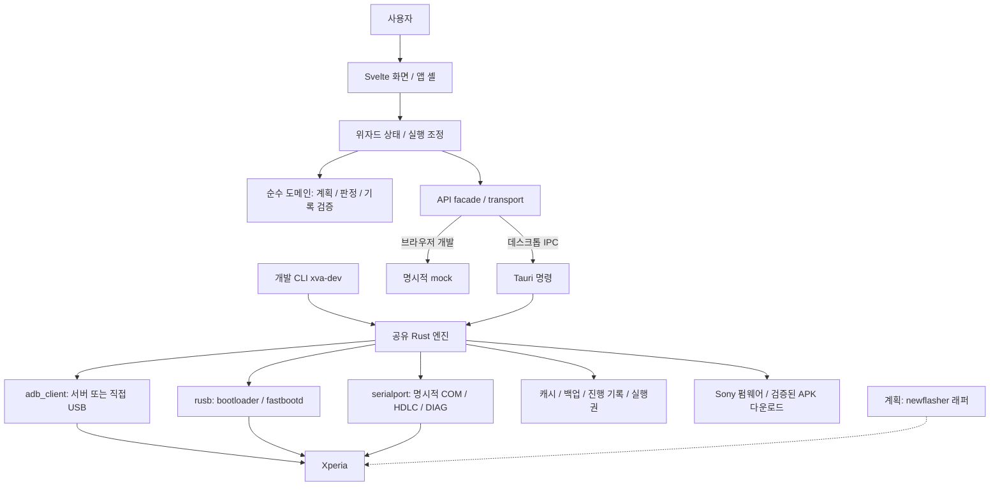

# 시스템 구조

기준일: 2026-10-07. Windows용 Tauri 앱과 개발 CLI가 Rust 라이브러리를 공유합니다. 화면의 작업 계획과 사용자 대기는 TypeScript 위자드가 담당합니다.

## 전체 형상

데스크톱 IPC 실패를 mock 성공으로 바꾸지 않습니다. 일반 개발 빌드의 화면 실행은 시뮬레이션이며, 실전 엔진으로 넘어가는 플래그와 Rust 쓰기 feature는 별도입니다.

## 소스의 책임

| 경로 | 책임 |
|---|---|
| `src/routes/+page.svelte` | 앱 셸·화면 전환·뒤로 이동·창 종료 처리 |
| `src/lib/views`, `components` | 화면·입력·통신 패널·안내. 직접 기기 I/O 없음 |
| `src/lib/stores/wizard.svelte.ts` | 선택 기기, 사용자 입력, 실행 순서, 수동 대기, 재개·완료 |
| `src/lib/domain` | 계획 생성, 실전 조합 검사, IMS 판정, 기록 파싱, 순차 저장 |
| `src/lib/data` | 기종별 파티션/참고 사항, 프리셋 manifest, 실행 플래그 |
| `src/lib/api` | 프론트의 모든 IPC·이벤트·브라우저 mock 경계 |
| `src-tauri/src/adb.rs`, `ims.rs`, `usbmode.rs` | 기기 상태·연결·IMS 해석·USB 모드 |
| `src-tauri/src/backup`, `fastboot`, `magisk`, `efs` | 백업/복구, 부트 기록, 루팅, 모뎀 설정 엔진 |
| `firmware.rs`, `boot_image.rs`, `apk_verify.rs` | 다운로드·추출·이미지 출처/해시·APK 입력 검증 |
| `device_io.rs`, `storage.rs`, `journal.rs`, `guard.rs` | 공유 실행권·파일 저장·진행 기록·PC 보호 |
| `dev_cli.rs`, `events.rs`, `bin/xva-dev.rs` | 같은 엔진의 명령별 개발 실행·JSON Lines 이벤트 |
| `src-tauri/vendor/adb_client` | 상한·USB 전송·재연결 등을 보강한 ADB 라이브러리 사본 |

## 기능의 현재 상태

| 기능 | 구현/검증 범위 | 상세 |
|---|---|---|
| 기기·SIM·IMS 감지 | 읽기 엔진 구현, XQ-DQ44 관찰 기록 있음 | [감지](device-detection.md), [통신](communication.md) |
| 백업 | 엔진 구현·대용량 실측 있음. 권한 거부와 후속 수정 범위 구분 | [백업/복구](backup-restore.md) |
| 복구 | 엔진·오프라인 검증 있음. 초기화 후 전체 실기기 복구 미완료 | [백업/복구](backup-restore.md) |
| 언락·부트 기록 | 구현, XQ-DQ44 실기기 사례 있음 | [부트로더](bootloader.md) |
| 리락·언루팅 | 조건부 구현, 전체 실기기 확인 대기 | [부트로더](bootloader.md), [루팅](root-unroot.md) |
| Magisk 루팅 | 공유 CLI에서 XQ-DQ44 단계별 성공 | [루팅](root-unroot.md) |
| EFS/VoLTE | 네이티브 엔진 구현. XQ-DQ44/SKT SIM1 등록·통화 성공, 일부 후속 처리의 작업 트리 수정 포함 | [VoLTE](volte.md), [기기 기록](../devices.md) |
| 부트 이미지 다운로드 | 부분 취득·SIN 추출 구현 | [펌웨어](firmware.md) |
| 전체 펌웨어 업데이트 | 계획/화면 단계 존재, 전체 취득·플래시 엔진 미구현 | [펌웨어](firmware.md) |
| 자동/수동/업데이트 선택 | 2026-10-07 draft, 화면·분기 미구현 | [작업 흐름](workflow.md) |

기종을 코드에서 인식하는 것, 엔진이 구현된 것, 특정 단말에서 한 단계가 성공한 것, 전체 GUI가 검증된 것은 서로 다른 상태입니다. [기기별 메모](../devices.md)에 정확한 검증 범위를 남깁니다.

화면 분기 변경은 [작업 흐름](workflow.md), 모델별 분기 변경은 [기기별 메모](../devices.md)를 먼저 확인합니다. 엔진 수정은 해당 기능 문서와 `.plans` 계약을 같이 갱신합니다. [개발과 검증](development.md)에 확인 방법을 정리했습니다.
