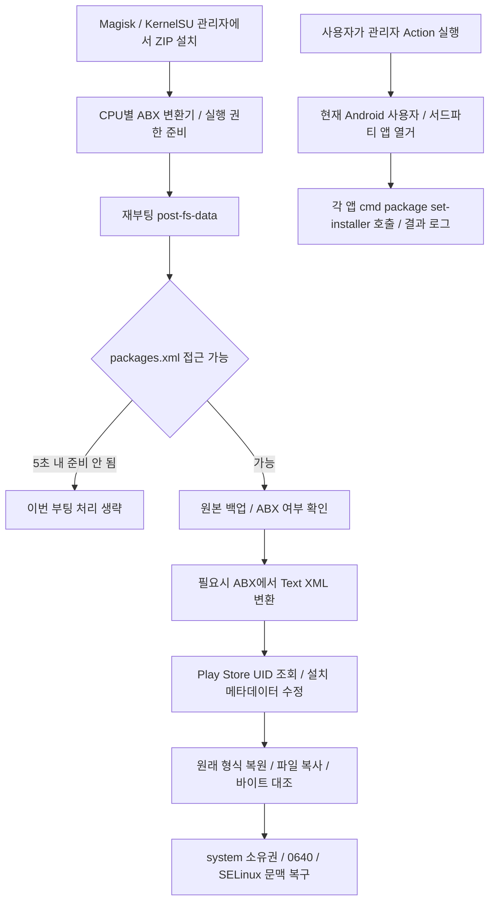

# PlayStoreFix: 카페 v3.4와 공개 기반 비교

조사일: 2026-10-08. 저장소에 동봉한 카페 원본 ZIP을 읽고 공개 BetterKnownInstalled(BKI) 소스·릴리스와 비교했습니다. 모듈 스크립트를 실행하거나 실제 폰의 패키지 DB를 변경하지 않았습니다.

**같은 목적의 공개 모듈은 구할 수 있습니다. 카페 v3.4와 같은 Action·부팅 스크립트·한국어 안내를 묶은 외부 배포본은 이번 조사에서 확인하지 못했습니다.** 카페판에 한국 금융앱만을 위한 패키지 목록이나 Sony 모델별 분기는 없었습니다. HMA 국내 앱 프리셋과 소스 정책을 구분해야 합니다. 현재 프로그램은 PlayStoreFix 카페 ZIP을 그대로 동봉하며 공개 BKI로 자동 교체하지 않습니다.

## 확인한 파일과 비교 기준

| 대상 | 고정 근거 |
|---|---|
| 카페 원본 | `SonyUserCommunity_PlayStoreFix_v3.4_Magisk-KernelSU.zip`, 3012793바이트, SHA-256 `3a1caa209914221350baac783d6da645eb60ec5e64f680fbc745e912b0ed6c34` |
| 출처 | [앨리자 글 617249](https://cafe.naver.com/x1smart/617249)의 Google Drive 배포 링크. 원본/취득 기록은 [동봉 manifest](../../src-tauri/assets/root/README.md) |
| 카페판 메타데이터 | `id=sonyusercommunity_playstorefix`, `version=v3.4.0`, `versionCode=340`; Magisk/KernelSU 공용 표기 |
| 공개 구버전 비교 | [BKI v1.4.0, 태그 1400](https://github.com/Pixel-Props/BetterKnownInstalled/tree/1400), `post-fs-data.sh`·`customize.sh` 소스. 부팅 스크립트 구조가 비슷해 비교 기준으로 사용 |
| 공개 최신판 비교 | [BKI v1.6.1, 태그 1610](https://github.com/Pixel-Props/BetterKnownInstalled/releases/tag/1610), 커밋 `b997eaef608e19d358ff60e19b3fbdd0bef75ac3`, 2026-09-11 게시 |
| 최신판 다운로드 검증 | `BetterKnownInstalled-v1.6.1.zip`, 3022006바이트, API digest와 다운로드 SHA-256 `aeaa0b6ba5f4785da526aa9e94b1e87da8ea47b005eb700e752c70f0018fec19` 일치 |

카페 README는 DoubleHack의 통합 모듈, CITRA의 재설치 아이디어, T3SL4의 BKI, rhythmcache의 ABX 변환기를 기반으로 표기합니다. **DoubleHack/CITRA의 직접 부모 배포본과 카페판 수정 커밋은 확보하지 못했습니다.** 아래는 확보한 카페판의 실제 동작과 공개 BKI와의 차이이며, 특정 변경을 누가 어느 버전에서 만들었는지 확정한 수정 이력은 아닙니다. 카페판 v3.4와 BKI v1.6.1의 버전 숫자는 서로 다른 프로젝트의 번호입니다.

## 카페판 내부 동작

| 파일 | 실제 처리 |
|---|---|
| `customize.sh` | 관리자 안에서의 설치만 허용. CPU ABI별 변환기 존재 확인·실행 권한 부여, Magisk/KernelSU 환경 표시. 리커버리 설치 차단 |
| `post-fs-data.sh` | `/data/system/packages.xml` 읽기/쓰기 가능 여부를 최대 5초 확인. 원본 `.bak` 저장 후 ABX 헤더를 구별해 텍스트로 변환하고 수정. 원래 형식으로 복원한 수정본을 `cp -f`로 적용하고 `cmp`로 대조 |
| 같은 부팅 스크립트 | Play 스토어의 `userId`를 조회해 `installer`, `installInitiator`를 `com.android.vending`, `installerUid`/`installerUid-int`를 해당 UID로 지정. `packageSource=2`를 추가/정규화. `installOriginator`, 참인 `isOrphaned`/`installInitiatorUninstalled` 제거 |
| `action.sh` → `set_play_store_installer.sh` | 루트 권한·현재 사용자 Play 스토어 존재 확인. `pm list packages -3 --user`로 앱을 열거하고 `cmd package set-installer` 호출. 전체·성공·실패를 `action.log`에 기록 |
| `util_functions.sh`·ABX addon | 변환 실패/빈 출력 확인, CPU별 도구 연결. 원본·수정본 백업을 종류별 최대 4개로 회전하고 로그도 회전 |

Action에는 APK 재설치·삭제·앱 데이터 초기화 명령이 없습니다. README의 “Reinstall” 표현에도 실제 카페 v3.4 Action은 **설치 출처 메타데이터 변경**입니다. APK와 split APK를 다시 설치하지 않는 구조라고 설명할 수 있지만, 실행 결과·데이터 무손실·Google/금융앱 판정을 실기기에서 보장한 것은 아닙니다.

부팅 경로와 Action의 범위도 다릅니다. Action은 현재 사용자의 서드파티 앱을 열거하지만, 부팅 스크립트는 시스템 전체 `packages.xml`에서 `system="true"/"1"`인 줄만 제외합니다. `/data/app/` 경로로 한정하는 검사는 없고, 여러 줄에 걸친 `<package>` 요소 전체를 읽는 XML 파서도 없습니다. Android 버전/제조사에 따라 메타데이터 형식이 달라질 때의 실제 성공 여부는 별도 확인이 필요합니다.

## 공개 BKI와 확인한 차이

| 항목 | 카페 v3.4 | 공개 BKI |
|---|---|---|
| Action | 현재 사용자 앱의 설치 출처를 일괄 변경하는 두 스크립트 포함 | v1.6.1 ZIP에 해당 두 스크립트 없음 |
| v1.4 대비 범위 | `system=true/1` 제외, `packages-warnings.xml` 처리 없음 | v1.4는 그 시스템 제외 검사가 없고 warnings 파일도 처리 |
| v1.4 대비 속성 처리 | 없는 `packageSource` 추가, orphan 관련 `true/1` 정리, 줄 정규화 후 처리 | 구버전 속성 치환과 차이가 있음. 카페 전용 발명이라는 의미는 아님 |
| 형식·오류 처리 | 첫 3바이트 ABX 확인, 백업/변환 실패 시 중단, 최대 5초 준비 대기, 한국어 로그 | v1.4의 `file` 기반 형식 판정·최대 30초 대기와 다름 |
| 최신판 사용자 앱 범위 | 줄 단위, 시스템 플래그 제외만 적용 | v1.6.1은 `/data/app/`와 시스템 플래그를 검사하고 여러 줄의 package 요소를 `awk`로 처리 |
| 최신판 ABX 속성 변형 | UID의 `-int`는 처리. source의 `-int` 및 orphan 관련 `-bool` 전용 처리 없음 | v1.6.1은 이 변형들도 처리 |
| 적용·제거 | 원본을 `cp -f`로 덮고 대조. `.bak` 백업은 있지만 `uninstall.sh`/앱별 원상복구 DB 없음 | v1.6.1에는 `.tmp` 후 rename 적용, 앱별 원래 값 `metadata.db`, 제거 시 복원 스크립트가 있음 |
| 바이너리 | 다섯 ABI의 `abx2xml`/`xml2abx` 10개 포함 | v1.6.1 ZIP의 같은 경로 10개와 **모두 SHA-256 동일** |
| 배포 표기 | 소니사용자모임 모듈 ID·이름·한국어 설치/로그·README | BKI 고유 ID·안내. 두 ZIP의 `LICENSE` 파일은 바이트 동일한 GPLv3 |

카페판은 단순 번역본으로 취급할 수 없습니다. 동시에 공개 최신 BKI보다 모든 처리가 개선된 상위판이라고도 판단할 수 없습니다. 특히 여러 줄 XML, 속성 타입 접미사, 제거 시 복원, 쓰기 방식에는 공개 최신판에 있는 처리가 카페판에는 없습니다. 카페 ZIP 자체를 수정하지 않았고 프로그램의 모듈 제거 기능이 이 ZIP에 없는 원상복구를 대신하지도 않습니다.

## 외부에서 같은 수정을 구할 수 있는가

- **BKI 자체와 메타데이터 보정 기능:** 공식 [GitHub 소스](https://github.com/Pixel-Props/BetterKnownInstalled)·릴리스에서 받을 수 있습니다. Sony 카페에서만 얻어야 유효한 기능은 아닙니다.
- **Action의 기술:** 일반 Android 패키지 관리 명령으로 구현되어 있습니다. 국내 앱 이름이나 Sony 고유 데이터에 의존하지 않아 재구현은 가능하다는 코드상의 판단입니다. 같은 효과를 모든 OS/앱에서 확인했다는 뜻은 아닙니다.
- **카페 v3.4 그대로의 통합 ZIP:** 카페 파일명·module ID·제목·제작자 조합으로 공개 검색하고 BKI 공식 저장소/릴리스를 확인했으나, 동일 스크립트와 해시를 가진 별도 공개 배포처는 확인하지 못했습니다. 직접 부모 DoubleHack/CITRA 통합본도 확인하지 못해 완전한 원본 대비 패치를 산출할 수 없습니다. 검색 실패가 외부에 존재하지 않는다는 증명은 아닙니다.

따라서 현재 요구에 맞춰 **카페 v3.4를 원본 그대로 유지**합니다. 공개 BKI로 바꾸려면 Action 제공 방식, 모듈 ID 변경/공존 여부, 기존 설치 메타데이터·제거 시 복원 정책을 별도 결정하고 실기기 검증해야 합니다. 이번 변경은 그 교체를 수행하지 않습니다.
