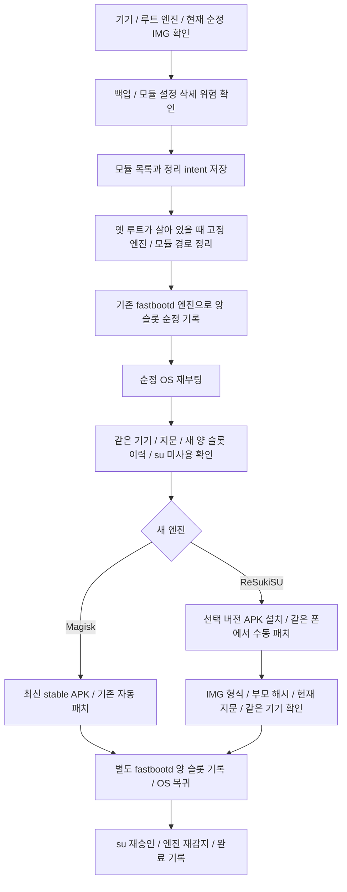

# 수동 루트 엔진과 모듈

기준일: 2026-10-08, `newflasher-add`. 구현 파일: `root_state.rs`, `root_tools/`, `flasher/root_plan.rs`, `api/rootTools.ts`, `RootToolsView.svelte`. 코드와 오프라인 검증을 추가했으며 실기기 검증은 하지 않았습니다.

## 화면과 실행 제한

기기 첫 화면의 **수동 작업 · 루트 엔진 / 모듈** 버튼에서 엽니다. 기존 VoLTE 자동 절차에 엔진 전환/모듈 설치를 끼워 넣지 않습니다. 세션의 기기를 고정하고 이 화면에서는 기기 목록 폴링을 멈춥니다. 엔진·모듈 조회도 사용자 클릭으로만 요청합니다. su 허용 창은 폰에서 응답해야 합니다.

설치·정리에는 Cargo `root-tools-write`가 필요하며 이 feature는 `root-write`를 포함합니다. 부트 기록/엔진 전환에는 `fastboot-write`도 필요합니다. GUI는 기존 `REAL_STEPS.root/fastboot`와 위험 확인을 함께 검사합니다. `default=[]`와 REAL_STEPS 기본값은 그대로 꺼져 있습니다. CLI도 같은 함수를 호출하며 기기 변경에는 `--allow-device-write`가 필요합니다.

GUI는 작업 중 PC 보호를 켜고 호출이 끝난 뒤 해제합니다. 변경 함수는 공통 `WriteOperation`을 사용합니다. 창 닫기와 화면 이탈은 호출 중 차단합니다. 모듈/전환 상태는 동일 기기의 해시 키로 PC에 저장하고 원본 serial·IMEI를 기록하지 않습니다.

## 엔진 감지

`root_inspect`는 su `id`, su 버전 표식, 권한 있는 `/data/adb` 마커를 함께 대조합니다. `magisk/magisk.db`와 `ksu/ksud`는 설치 흔적이므로 그 자체를 활성 엔진 증명으로 사용하지 않습니다. Magisk와 KernelSU 계열이 동시에 남았거나 버전 표식과 마커가 충돌하면 진행을 막습니다. 숨긴 매니저의 패키지명으로 루트를 판정하지 않습니다.

권한은 granted/unavailable/denied/unknown, 엔진은 magisk/kernelsu-family/conflicting/unknown입니다. su 없음·거부 상태에서는 마커를 null로 둡니다. 없어졌다고 추측하지 않습니다. 기존 `root_check` boolean 계약은 유지하며 이 값만으로 엔진이나 순정 상태를 결정하지 않습니다.

공통 su 선택은 PATH → 실행 가능한 `/debug_ramdisk/su` → legacy `/system/xbin/su` → KernelSU의 `/system/bin/su` 실행 경로입니다. `/data/adb/ksud`는 일반 su 대체품으로 호출하지 않습니다. [KernelSU su 소스](https://github.com/tiann/KernelSU/blob/main/userspace/ksud/src/su.rs), [ReSukiSU rc3 su 소스](https://github.com/Baka-SU/BakaSU/blob/v4.2.0-rc3/userspace/ksud/src/android/su.rs), [Magisk su 소스](https://github.com/topjohnwu/Magisk/blob/master/native/src/core/su/su.cpp)를 참조했습니다. KernelSU 세부 포크는 같은 버전 브랜드를 사용할 수 있으므로 ReSukiSU라고 단정하지 않습니다.

## 엔진 전환

정리는 `/data/adb/modules`, `modules_update`, `metamodule`, `magisk`, `magisk.db`, `ksu`, `ksud`의 고정 경로만 대상으로 합니다. `/data/adb` 전체, 앱 데이터, EFS, keybox 저장 경로는 재귀 삭제하지 않습니다. 남은 엔진 확장 설정·숨긴 매니저 앱은 직접 제거 안내가 필요합니다. 엔진 교체에 필요한 관리자 앱 제거를 임의 패키지 검색으로 자동 실행하지 않습니다.

정리 전 목록과 intent를 저장하며 실패/중단 후 자동 재정리하지 않습니다. 순정 확인은 다른 boot ID, 동일 현재 지문과 **정리 시작 이후 추가된 양 슬롯 순정 ACK 이력**을 요구합니다. 과거 기록, 같은 OS 세션, 한 슬롯만 기록, su 거부는 통과하지 못합니다. 중간 순정 확인을 생략하는 단축 경로는 제공하지 않습니다. 실패가 cleanup-intent에 남으면 수동 복구가 필요합니다.

일반 Magisk 패치도 진행 중인 전환 기록을 확인합니다. KernelSU/권한 불명 상태를 Magisk로 조용히 덮지 않습니다. ReSukiSU 외부 IMG 가져오기는 새로 확인한 순정 이미지와 같은 기기·현재 지문·부모 해시를 연결하고 raw 헤더/파티션 종류·크기·원본과 다른 결과를 검사합니다. **사용자가 같은 폰에서 패치했다는 확인은 암호학적 생성 증명이 아닙니다.** 외부 패치 입력임을 분명히 하고 기록 전의 해시/기기/슬롯 게이트는 유지합니다.

현재 ReSukiSU 외부 패치 경로는 `init_boot`만 허용합니다. `boot` 기종의 LKM/GKI·커널 조건을 init_boot 결과로 대신하지 않습니다. 모듈 기능은 지원하는 루트 엔진을 이미 확인한 폰에서 사용할 수 있으나 기종별 실측은 별도입니다.

## ReSukiSU 버전과 APK 검증

Magisk는 기존 최신 stable 준비를 유지합니다. ReSukiSU는 사전 버전을 포함한 릴리스 목록·발행일을 보여 주고 사용자가 태그를 고릅니다. 2026-10-08에 기존 저장소가 [Baka-SU/BakaSU](https://github.com/Baka-SU/BakaSU)로 연결되며 rc1~rc3가 모두 prerelease인 것을 확인했습니다. 이후 stable 존재 여부를 영구 가정하지 않고 응답의 prerelease 값을 표시합니다.

선택 태그의 유일한 arm64 release APK만 받습니다. API 자산 크기/SHA-256, 서명 블록의 인증서 핀, 내장 `lib/arm64-v8a/libksud.so`를 검사합니다. rc3 기준 자산 해시는 `25657bc449439687608fffa04b4b586de90fc405e3dc6217bd997fc71ba0a0a1`, 인증서 핀은 `d3469712b6214462764a1d8d3e5cbe1d6819a0b629791b9f4101867821f1df64`입니다. 원본 APK를 저장소에 포함하지 않았습니다. 인증서 블록 핀은 완전한 APK 서명 암호 검증이 아니며 실제 설치 서명은 Android가 확인합니다.

ksud 별도 릴리스 자산이 매번 있다고 가정하지 않습니다. 현재 루틴은 APK의 ksud 존재만 검사하고 직접 추출/실행하지 않습니다. APK 설치 뒤 매니저의 이미지 패치 1회는 수동입니다.

## 모듈 준비·설치·복구

공개 모듈은 코드에 고정된 GitHub 저장소의 최신 stable 릴리스에서 유일한 비 debug ZIP을 선택합니다. 태그/파일명/정확한 다운로드 출처·API digest·크기를 검사합니다. 여러 자산, digest 누락, 변경된 출처는 임의 선택하지 않고 실패합니다. 캐시 재사용/설치 시 저장한 바이트를 해싱하고 ZIP을 다시 검사합니다.

해시 누락의 유일한 예외는 [Zygisk Assistant v2.1.4](https://github.com/snake-4/Zygisk-Assistant/releases/tag/v2.1.4)의 `Zygisk-Assistant-v2.1.4-1013f8a-release.zip`입니다. 해당 GitHub 자산에는 digest가 없어 2026-10-08 공식 HTTPS 주소에서 취득한 바이트의 고정 핀 `9eca30a269dc676a66f67a9339185dee55cccd47dc1fc8eeea5416124626d67a`를 코드에 넣었습니다. 정확한 저장소·태그·파일명에만 적용하고 다른 무해시 릴리스는 거부합니다. 이것은 배포자가 제공한 암호학적 서명이나 해시가 아닙니다. Shamiko ZIP의 XZ 압축도 원본 그대로 검사하기 위해 [zip 크레이트의 xz 지원](https://docs.rs/zip/8.6.0/zip/)을 켰습니다.

카페 전용 세 ZIP과 HMA JSON은 [동봉 파일·해시·출처](../../src-tauri/assets/root/README.md)를 따라 포함합니다. 배포 갱신 시 고정 핀도 함께 바꿔야 합니다. 공개 모듈을 카페 스냅샷으로 자동 대체하지 않습니다. Zygisk Next는 현재 공개 배포 위치인 [LSPosed/ZygiskNext](https://github.com/LSPosed/ZygiskNext/releases)를 조회합니다.

설치 직전 현재 엔진/모듈 목록을 다시 확인합니다. KernelSU 계열은 카페의 구성 순서에 맞춰 OverlayFS 먼저, Zygisk 구현체 택일, PlayIntegrityFork/Integrity Box 택일, TrickyStore→TrickyAddon, Shamiko는 Magisk+Zygisk Next를 요구합니다. 일반 KernelSU의 metamodule 필요 여부는 모듈의 시스템 파일 변경에 달려 있지만 이 설치 도구는 카페 구성의 선행 조건을 보수적으로 적용합니다. [KernelSU 모듈 문서](https://kernelsu.org/guide/module.html)를 참조하세요.

실제 공개 ZIP에서 NeoZygisk/Next의 ID는 둘 다 `zygisksu`, PIF/Integrity Box는 둘 다 `playintegrityfix`인 것을 확인했습니다. 도구의 설치 영수증으로 종류를 구분하고, 동일 ID 교체가 성공하면 이전 종류의 영수증을 지웁니다. 기록 없는 공유 ID는 택일 변경과 Shamiko 선행 증명에 쓰지 않습니다. 해당 모듈을 끄고 재부팅한 뒤 도구에서 다시 설치해야 합니다. 영수증은 이 도구가 설치한 출처 기록이며 외부에서 같은 ID의 내용을 덮어쓴 상태를 인증하지 않습니다. 도구 밖에서 변경했다면 기존 영수증을 신뢰해 모듈을 추가하지 말고 현재 구성부터 확인하세요.

설치 intent → 고정 임시 ZIP 전송 → 폰 SHA-256 대조 → Magisk/ksud 설치 → 임시 ZIP 정리 → ACK 저장 순서입니다. 새 boot ID와 설치된 모듈의 활성 관찰을 확인하기 전에는 다음 설치를 막습니다. 설치 실패나 ACK 저장 실패는 불확정으로 남고 자동 재시도하지 않습니다. 끄기·제거 예약은 설치 목록의 유효 ID만 받으며 다음 재부팅을 요구합니다. 오류 검토 후 별도 수동 재확인으로 PC 불확정 기록을 해제할 수 있습니다. 이것은 실패한 설치의 성공 판정이 아닙니다.

설정 UI를 자동 누르거나 keybox를 배급하지 않습니다. PIF Action, TrickyAddon WebUI 설정, HMA JSON 가져오기·은행 앱 scope 보강, 앱별 su 권한 승인과 검증은 수동입니다. WebUI/MMRL은 배포 안내 링크입니다. 앱·Google 서비스 데이터를 자동 삭제하지 않습니다. 모듈 설치 완료와 Play Integrity/금융앱 성공을 구분합니다. [Google 판정 기준](https://developer.android.com/google/play/integrity/verdicts)은 개별 금융앱 호환성 보장이 아닙니다.

## Newflasher 업데이트와의 연결 상태

`firmware_update_root_plan`은 PC에서 관찰값을 받아 정책을 계산하는 **안내용** 계약입니다. 항상 writeReady=false입니다. locked/nonroot 순정 업데이트에 루트·언락을 요구하지 않습니다. Magisk 루트 유지에만 같은 폰의 새 목표 IMG 사전 패치·순정 SIN 기록·별도 fastboot 적용 요건을 냅니다. KernelSU 계열/충돌/불명 상태를 Magisk 유지로 바꾸지 않습니다.

새 엔진 설치·전환은 **현재 버전** 이미지로 구현했습니다. 목표 버전 사전 패치 계약·전체 Newflasher 실행·업데이트 백업 화면 연결은 여전히 다음 범위입니다. 기존 현재 지문 대조를 완화하지 않았습니다. 백업을 선택하면 사람의 다음 진행이 필요하다는 정책 값만 반환합니다. [펌웨어 설명](firmware.md)과 [진행 기록](../../.plans/04-engine/newflasher-native-progress.md)을 참조하세요.
