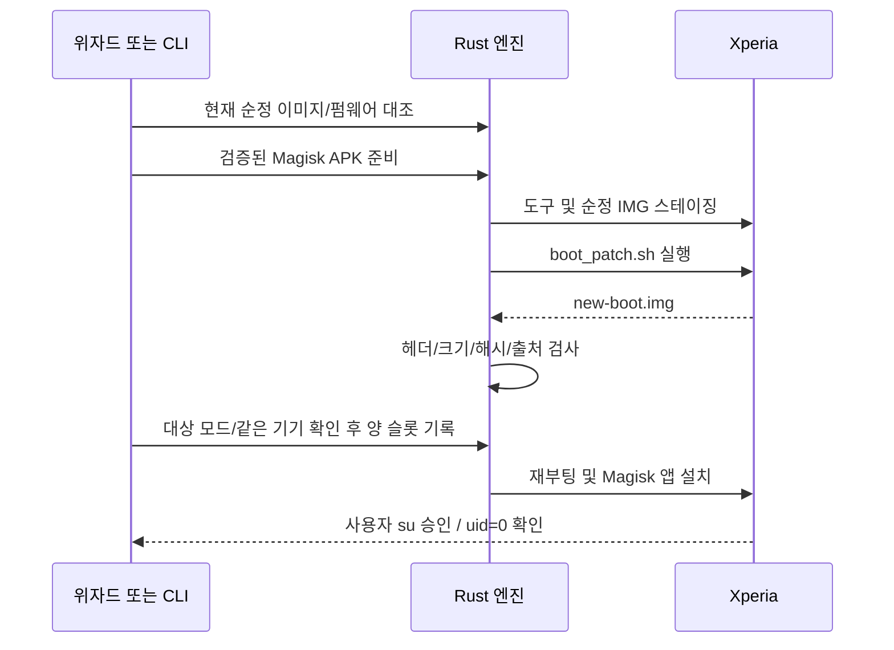

# 루팅과 언루팅

기준일: 2026-10-08. 담당: `magisk/mod.rs`, `magisk/patch.rs`, `firmware.rs`, `boot_image.rs`, `apk_verify.rs` 및 위자드의 root/unroot 러너.

## 부트 파티션 선택

`src/lib/data/devices.ts`의 모델 접두사 표가 GUI 계획의 기준입니다. CLI 호출자는 이 표에 맞는 파티션을 명시해야 하며, CLI 자체가 GUI 전체 분기를 실행하지 않습니다.

| 모델 접두사 | 대상 |
|---|---|
| XQ-DQ / XQ-DE / XQ-EC | `init_boot`: 1 V / 5 V / 1 VI |
| XQ-CT / XQ-CQ / XQ-CC / XQ-AT / XQ-AS / XQ-BC / XQ-BQ / XQ-BE / XQ-DC / XQ-ES | `boot`: IV·II·III·PRO-I·10 IV/V/VI |
| 표에 없는 모델 | 확인 불가, 자동 패치 차단 |

현재 Android 버전만으로 선택하지 않습니다. Xperia 10 V/VI도 코드의 `boot` 표를 따릅니다. 표에 있다는 것이 전체 기종 검증 완료라는 뜻은 아닙니다.

## Magisk 루팅

2026-10-08: 패치 전 `root_inspect`와 진행 중인 전환 기록을 추가 검사합니다. 기존 Magisk 유지 또는 su 미감지 상태만 허용하고 KernelSU·권한 거부·불명 상태를 바로 Magisk로 덮지 않습니다. 엔진 교체는 [수동 전환 도구](root-tools.md)의 순정 복원 단계를 거칩니다. 이 가드와 ReSukiSU 경로는 새 코드의 실기기 검증 전입니다.

`boot_image_check`는 기기 읽기 결과로 PC에 플래시 대조 근거를 저장하므로 공통 `WriteOperation`과 내부 작업 완료 대기를 사용합니다. 실제 기기 변경은 없지만 다른 기록/재부팅 작업과 동시에 오래된 대조 결과를 게시하지 않게 하며, 기기 쓰기 feature를 새로 요구하지는 않습니다. 수동 도구의 Magisk 준비는 패치·매니저 설치가 모두 성공한 후 적용할 IMG를 게시합니다.

APK는 릴리스 자산 digest·크기와 인증서 핀을 확인하고 캐시합니다. 인증서 핀 일치 자체를 APK 암호 서명 검증이라고 표현하지 않습니다. 설치 시 Android가 서명을 검증합니다. 오프라인이면 검증된 캐시만 사용합니다.

기기에서 고정 스테이징 경로와 셸 권한으로 패치 스크립트를 실행합니다. `KEEPVERITY=true`, `KEEPFORCEENCRYPT=true`, `PATCHVBMETAFLAG=false` 등 현재 옵션을 사용합니다. 외부 입력을 셸 명령으로 직접 보간하지 않습니다.

결과는 적절한 부트 헤더, 원본 대비 크기 범위, 원본과 다른 SHA-256, 파티션 적합성으로 검사합니다. 결과 출처에는 순정 부모 이미지·지문·파티션을 남깁니다. 일부만 성공하면 루팅 완료로 표시하지 않습니다.

XQ-DQ44의 `init_boot` 기록은 fastbootd에서 수행합니다. bootloader의 기록 거부를 무시해 같은 명령을 반복하지 않습니다. 모드·드라이버·슬롯 검사는 [부트로더](bootloader.md)를 참조하세요.

## ReSukiSU로 처음 루팅 (실기기 미검증)

2026-10-08 사용자 결정으로 루팅 단계에서 Magisk 대신 ReSukiSU(KernelSU 계열, `Baka-SU/BakaSU` 릴리스)를 고를 수 있습니다. 계획 확인 화면의 **루팅 엔진**에서 고르고 버전 태그를 지정합니다. `init_boot` 기종만 허용하며, `REAL_STEPS.rootTools`와 Cargo `root-tools-write`가 켜진 빌드에서만 선택할 수 있습니다(기본 꺼짐).

ReSukiSU는 LKM 방식이라 루트가 없는 폰에서도 매니저 앱이 순정 init_boot를 패치합니다. 패치에 쓰는 커널 모듈은 폰의 현재 커널 KMI(예: XQ-DQ44 67.2.A.3.178은 `android13-5.15`)를 따릅니다. PC가 패치를 대신하지 않으므로 한 번은 사용자가 폰에서 직접 누릅니다.

1. 현재 설치 버전 순정 이미지 대조(`boot_image_check`)
2. 선택한 태그의 매니저 APK 준비(digest·인증서 핀)·설치(`resukisu_install`)
3. 순정 init_boot를 `/sdcard/Download/xvolte_stock_init_boot_<해시>.img`로 전송(`resukisu_stage_stock`)하고 기기 시각을 기록
4. 수동: ReSukiSU 앱 → 설치 → 파일 선택 후 패치. 매니저가 `Download/kernelsu_patched_<시각>.img`를 만든다
5. 전송 시각 이후의 가장 새 결과를 크기가 멈춘 뒤 PC로 받고(`resukisu_fetch_patched`), `root_external_patch_import`로 순정 부모·같은 기기·헤더·크기·해시를 검사
6. fastbootd 양 슬롯 기록 → OS 복귀
7. 수동: ReSukiSU 앱 → 슈퍼유저에서 Shell 루트 허용(승인 창이 없음) → `su -c id` uid=0 확인

받은 파일은 검사 전 상태이며 검사를 통과한 이미지만 기록합니다. 앱 재시작 등으로 전송 기록이 사라지면 루팅 단계를 처음부터 다시 진행합니다.

## 루트 권한 확인

공통 su 경로는 PATH → 실행 가능한 `/debug_ramdisk/su` → `/system/xbin/su` → `/system/bin/su`입니다. KernelSU 계열의 ksud는 일반 su 폴백으로 쓰지 않습니다. 새 `root_inspect`는 권한·버전·마커를 대조하고, 버전/마커 충돌과 세부 포크 미확정을 반환합니다. 기존 boolean `root_check`는 엔진 식별 계약이 아닙니다.

기기 상태 카드의 루팅 표시는 su 위치, 루트 데몬(magiskd·ksud·apd), `/proc/modules`의 `kernelsu`(ReSukiSU LKM은 `/sys/module`에서는 숨지만 이 목록에는 남음)를 봅니다. 하나라도 있으면 루팅, 부트로더가 잠겨 있으면 비루팅입니다. 언락 상태에서 프로세스 목록을 읽었는데 근거가 없으면 비루팅으로 표시합니다. 단, KernelSU 계열 매니저 앱만 있고 근거가 없으면(커널 내장형 등) 판별 불가입니다.

`su -c id`의 uid=0이 근거입니다. 현재 Magisk 환경에서는 PATH에 su가 없고 `/debug_ramdisk/su`만 있을 수 있으므로 공통 `device_io::su!` 경로를 사용합니다.

폰 화면이 잠겨 있거나 꺼져 있으면 승인 창을 볼 수 있는 상태를 먼저 확인합니다. Magisk에서 Shell 권한을 거부한 경우 승인 설정을 안내하며, 거부/응답 없음은 루트 없음이나 작업 성공으로 바꾸지 않습니다.

## 언루팅

현재 설치 버전의 순정 이미지를 대조한 뒤 양 슬롯에 재기록하고 OS 복귀·루트 상태를 확인합니다. 루트 해제가 확인되면 Magisk 앱(`com.topjohnwu.magisk`)을 삭제합니다(`magisk_uninstall`). 확인하지 못했거나 앱 숨기기로 이름이 바뀐 경우는 직접 삭제하도록 안내합니다. 다른 버전 IMG를 임의로 덮어쓰지 않습니다. 수동 언루팅은 초기화가 없으므로 백업 단계를 넣지 않습니다.

리락 요청이면 순정 복원이 필수 선행 조건입니다. 언루팅만으로 리락이 자동 실행되는 것은 아닙니다. 새 버전 업데이트 뒤 루팅 재적용에는 새 버전의 이미지가 필요합니다. 전체 업데이트 기록 엔진은 아직 미구현입니다.

XQ-DQ44/Magisk 30.7 CLI 단계별 루팅과 GUI 수동 언루팅(순정 양 슬롯 기록·루트 해제)은 확인했습니다. Magisk 앱 자동 삭제·ReSukiSU 처음 루팅·다른 모델·Magisk 버전은 분리해서 기록합니다. [기기별 기록](../devices.md)과 [실기기 체크리스트](../../.plans/04-engine/device-test-checklist.md)를 확인하세요.

## 예정: 업데이트 전 이미지 패치

업데이트 안내·공통 백업 선택 후 루팅 유지가 선택되면 **목표 버전**의 순정 boot/init_boot를 업데이트 전에 같은 폰에서 패치하고 PC에 보관할 계획입니다. 이미지 생성 자체와 부트 기록 권한은 별개입니다. 이미지 패치는 기존 루트가 없어도 가능하지만 수정 IMG 기록/부팅에는 unlocked 상태가 필요합니다. 이미 언락돼 있어도 비루팅 사용자의 기본 선택은 비루팅 유지입니다. 잠금을 유지하려고 별도 패치를 할 필요는 없습니다.

Newflasher의 순정 SIN 기록과 Magisk raw IMG 기록은 별도 단계입니다. 수정 IMG를 SIN으로 이름 변경/삽입하거나 이전 버전 패치 IMG를 남기지 않습니다. 같은 목표 펌웨어의 순정 부트를 Newflasher로 기록한 뒤 검증된 fastboot/fastbootd 경로에서 새 패치 IMG를 적용합니다. [Newflasher 소스](https://github.com/munjeni/newflasher/blob/master/newflasher.c), [Magisk 설치 문서](https://topjohnwu.github.io/Magisk/install.html)가 각 입력/기록 경로의 근거입니다.

현재 `magisk_patch_with_events`는 `boot_image::verify_fingerprint`로 **현재 설치 지문**을 검사합니다. 따라서 미래 버전 사전 패치를 기존 API에 그대로 넘기는 흐름은 아직 불가능합니다. 출발 지문·목표 펌웨어의 검증된 출처·파티션·순정 부모/패치 해시·같은 기기를 묶은 준비 계약을 추가하고 일반 루팅의 지문 검사는 유지해야 합니다.

검증된 조합에서는 Newflasher 후 직접 fastboot로 전환해 OS 첫 부팅 전에 기록할 수 있도록 설계합니다. 순정 기록 완료 증명·기기/모드/슬롯 검사와 현재 API의 제약을 해결한 뒤에만 활성화합니다. 미검증 조합은 순정 OS로 부팅해 목표 지문을 확인한 후 기존 기록 경로로 준비 IMG를 적용합니다. boot 기종의 모드 검증을 init_boot 기종 결과로 대신하지 않습니다.

기존 Magisk 유지 또는 이미 unlocked인 기기의 명시적 신규 루팅 선택에만 이 단계를 넣고, locked 기기에 재언락·리락을 추가하지 않습니다. 지원하지 않는 루팅 방식·판별 불가 상태는 유지 가능으로 표시하지 않습니다. vbmeta 검증 해제·암호화 옵션 변경을 기본 추가하지 않고 목표 Android의 Magisk/모듈 호환을 따로 확인합니다.

순정 업데이트 뒤 패치 기록이 실패하면 업데이트 성공과 루팅 유지 실패를 따로 표시하고 검증된 이미지/진행 기록을 보존합니다. 해당 경로는 구현/실기기 검증 전입니다. [분기 계획](../../.plans/04-engine/workflow-modes-20261007.md)의 상태·재개·검증 기준을 따릅니다.

## 모듈·매니저 데이터 정리와 매니저 변경 (2026-10-08)

언루팅(리락 앞의 언루팅 포함)은 순정 이미지를 기록하기 전, 루트가 있을 때 `root_wipe`로 `/data/adb/*`(설치된 모듈·Magisk/KernelSU 데이터·슈퍼유저 권한)를 비웁니다. 언루팅 뒤에도 이 데이터는 남아 있다가 같은 엔진으로 다시 루팅하면 되살아나므로, 엔진에 맞지 않는 모듈이 부트 루프를 일으키지 않게 지웁니다. 모듈·설정을 다른 엔진으로 옮기지는 않습니다(마운트·Zygisk·숨김 방식이 엔진마다 다름). 끝나면 Magisk·ReSukiSU 매니저 앱을 지웁니다.

루팅 매니저 변경은 "순정 이미지 준비 → 기존 루팅 해제(위 정리 포함) → 다른 엔진으로 루팅" 계획입니다. 언락·초기화는 없습니다. 실기기 미검증입니다.
