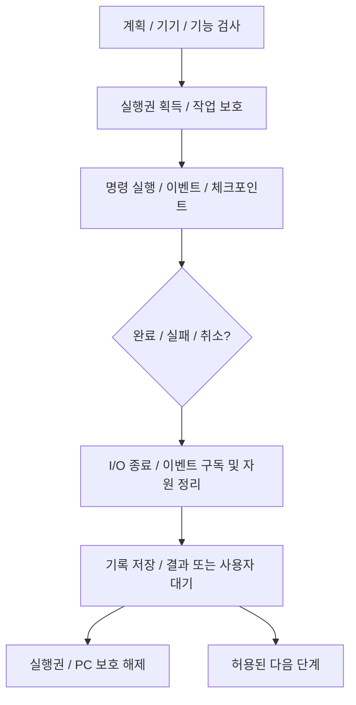

# 실행 기록·중단·재개와 PC 보호

기준일: 2026-10-07. 담당: `wizard.svelte.ts`, `domain/journal.ts`, `domain/asyncQueue.ts`, Rust `journal.rs`, `device_io.rs`, `guard.rs`, `storage.rs`, `events.rs`.

## 실행권과 수명

GUI와 개발 CLI가 같은 기기에 동시에 변경 작업을 실행하지 않도록 프로세스 내부 실행권과 OS 파일 잠금을 사용합니다. 백업 등 충돌할 수 있는 작업도 해당 엔진의 실행권을 공유합니다. 중단 버튼을 눌렀다는 이유만으로 진행 중인 I/O의 실행권을 반환하지 않습니다.

`runGen`과 조회 세대는 중단/처음으로/기기 교체 뒤의 늦은 완료를 무시합니다. 정상적인 제한 시간·취소는 결과가 확실한 경계에서 처리합니다. 이미 전송한 기기 쓰기를 강제 취소하거나 자동으로 재전송하는 보장은 없습니다.

## 진행 기록

기기 식별값의 해시를 사용한 journal에 선택·실행 단계·커서·수동 대기·백업 결과·이미지 준비·통신 확인을 저장합니다. 원자 저장과 순차 큐로 이전 응답이 최신 기록을 덮지 않도록 합니다. 기록 없음, 파싱 실패, 저장 실패를 구분하며 읽기 실패를 새 빈 기록으로 대체하지 않습니다.

재개는 같은 기기와 현재 상태를 확인하고 완료된 검증도 필요한 범위에서 다시 검사합니다. 파괴 명령을 과거 running 상태만으로 자동 재생하지 않습니다. 구형 기록의 누락된 통신 증거는 확인 단계를 다시 열어 처리합니다.

별도의 `flash-history.jsonl`과 이미지 출처/기기 대조 기록은 [리락 게이트](bootloader.md)의 입력입니다. UI 진행 기록이 done이라고 부트 출처나 양 슬롯 실제 완료 검사가 생략되지는 않습니다.

현재 일반 단계 완료는 `awaitingNext` 대기입니다. 백업 뒤만 대기하고 나머지를 자동 전환하는 정책과 mode/manualOperation 추가는 [새 분기 계획](workflow.md)의 후속 변경입니다. 기존 기록의 대기를 자동 쓰기 승인으로 해석하지 않습니다.

## PC 보호와 저장 범위

- 작업 중 절전 방지(PowerRequest)와 Windows 종료 방지 안내를 사용합니다. 강제 종료 방지는 아닙니다.
- 완료·중단·오류·처음으로에서 해제하되 I/O가 남으면 종료까지 기다립니다. 창 종료 시 미완료 기록을 저장하며 저장 실패를 사용자에게 표시합니다.
- 앱 로컬 데이터에는 인증 키, firmware/Magisk 캐시, journal, 이미지 대조·플래시 이력, EFS 설정 등이 있습니다. 위치는 Tauri 경로 API로 얻습니다.
- 백업 폴더와 EFS 스냅샷은 사용자가 지정한 위치를 사용합니다. 한글/공백을 허용하고 경로 이탈·reparse point·일반 파일이 아닌 입력을 기능별로 검사합니다.
- IMEI·언락 코드·기기 원시 시리얼을 journal/공개 로그에 남기지 않습니다. 화면은 부분 마스킹을 사용합니다. 원본 백업과 NV 내용 자체는 민감할 수 있으므로 Git 추적 대상이 아닙니다.

## 사용자에게 남길 실패 정보

타임아웃·분리·원본 읽기 권한·파일 형식/해시·기기 불일치·기능 미활성을 구분합니다. 특정 작업이 성공했지만 재연결 또는 후속 검증이 실패했다면 단계의 부분 변경과 다음 확인을 표시합니다. 실패를 mock 결과로 바꾸거나 재시도만으로 이전 쓰기의 결과를 확정하지 않습니다.
