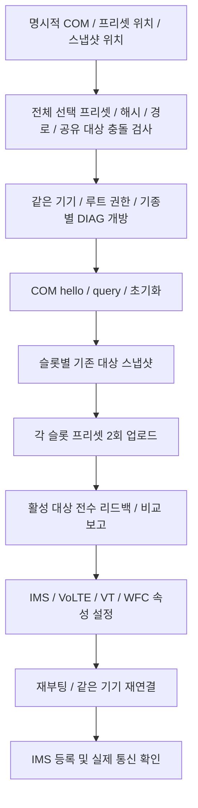

# VoLTE 패치: 프리셋·DIAG·EFS/NV

기준일: 2026-10-07. 담당: `src/lib/data/efsPresets.ts`, `types.ts`, `api/efs.ts`, 위자드 EFS 러너와 `src-tauri/src/efs/`.

## 준비와 기종별 분기

GUI에서 선택한 통신사·슬롯이 적용 대상입니다. SIM 자동 감지는 참고 정보이며 사용자의 선택을 다른 통신사로 바꾸지 않습니다. 현재 단일 `balance`/`20250901` 데이터 세트를 사용하고 폴더별 manifest 해시를 고정합니다. 도구 beta11과 EFS 데이터 날짜는 별개입니다.

SKT/KT/LGU/LGU_V × SIM1/SIM2의 8개 프리셋이 있습니다. GUI의 LG U+ 선택은 1 V/5 V 모델에서만 `LGU_V`로 해석합니다. 다른 모델의 사용자 사례만으로 이 분기를 확대하지 않습니다. performance 프리셋과 과거 세트로의 자동 롤백은 제공하지 않습니다. 프리셋 바이너리의 재배포 권리는 코드 라이선스와 별도이므로 현재 설정된 원본 bundle 경로에서 읽습니다.

1 IV/5 IV는 개발 USB 속성 보완을 수행합니다. II의 PDC 고정, IV의 특정 통신사 모뎀/PDC 대응, III/PRO-I 리락 후 외부 IMS 앱 설정은 안내 범위이며 이 앱이 자동 수행하지 않습니다. [기기별 알고리즘 표](../devices.md)를 함께 확인하세요.

## 처리 순서

기록하기 전에 **전체 선택 세트**를 검사합니다. 숫자 NV는 SIM별 경로가 없는 글로벌 대상이라 서로 다른 슬롯의 프리셋 값이 충돌하면 DIAG/쓰기 전에 차단합니다. 나중에 쓴 슬롯 값으로 조용히 덮어쓰지 않습니다.

COM 번호는 사용자가 지정합니다. 하나의 단말이 MSM/MDM/CNSS 등 여러 포트를 내보내도 이름만으로 올바른 포트를 자동 확정하지 않습니다. XQ-DQ44 세션에서 MSM 포트가 성공했지만 그 PC의 번호를 코드에 고정하지 않습니다.

## 네이티브 전송과 파일 해석

| 계층 | 동작 |
|---|---|
| `transport` | serialport, COM 번호 검증, 38400/8N1, 제한된 I/O 폴링 |
| `hdlc` | CRC16/X25, escape, 분할/합쳐진 프레임 수신, 크기 제한 |
| `session` | 요청 하나씩 처리, 7000ms 교환 상한, 응답 대조·취소·소유 descriptor 정리 |
| `device` / `diag` / `wire` | EFS 파일/item/NV 읽기·쓰기, 응답 형식·상태 해석 |
| `manifest` | 폴더 해시·허용 경로·metadata 접미사·숫자 NV·중복/충돌 검사 |
| `engine` | 스냅샷·업로드·리드백·명시적 복원·진행/경고 결과 |

manifest의 `__<mode>_<type>` 접미사는 원본 파일의 메타데이터 규칙으로 해석합니다. 숫자 NV는 허용된 루트 숫자 파일에서만 읽고 길이를 제한합니다. 빈 NV는 쓰거나 검증하지 않는 항목으로 경고하며, 논리 크기가 미확정인 짧은 NV는 제공된 prefix 범위만 비교합니다.

연결 분리/timeout/CRC/형식 오류로 결과가 불명해지면 세션을 계속 정상 사용하거나 쓰기를 자동 재전송하지 않습니다. 기기 I/O 잠금은 실제 작업 종료까지 유지됩니다.

## 스냅샷과 복원

현재 대상의 내용·해시·metadata·기존 존재 여부·raw NV를 PC에 저장합니다. 미완결 스냅샷은 복원 입력으로 거부합니다. 기존에 없는 EFS 대상은 복원 시 제거 대상으로 처리합니다. 최신 작업 트리에서는 `NV_NOTACTIVE(5)`를 “원래 값 없음”으로 기록하고 NV 복원은 건너뜁니다. NV 값을 삭제하는 명령을 지원한다는 뜻은 아닙니다.

복원은 사용자가 지정한 완결 스냅샷으로 실행합니다. 여러 슬롯의 스냅샷은 생성 역순으로 되돌려야 공유 대상의 원본을 복구할 수 있습니다. 시각 재적용·새 부모 폴더 제거와 자동 실패 롤백을 완전하게 보장하지 않습니다.

## 성공·경고 판정

1. 업로드 결과는 기록 과정의 성공/실패입니다.
2. 리드백 보고는 일치·누락·내용 차이입니다. **2026-10-07 최신 작업 트리 정책에서는 차이를 로그에 남기며 읽기 자체의 오류는 중단합니다.** 특정 두 파일이 모뎀에 의해 유지/재작성된 것으로 보이는 실측 뒤 사용자가 정한 정책입니다. 모든 차이가 무해하다고 판단하는 규칙은 아닙니다.
3. `volte_props_set`은 `persist.dbg.ims_avail_ovr`, `volte_avail_ovr`, `vt_avail_ovr`, `wfc_avail_ovr` 4종을 설정하고 모두 성공해야 재부팅합니다. 속성 설정은 통신사 서비스 검증이 아닙니다.
4. IMS 등록과 실제 발신·수신·음성 전달은 [통신 확인](communication.md)에서 별도로 확인합니다.

최신 개발 경로에는 로그/메시지 억제의 명시적 미지원 응답을 경고로 처리하는 보완이 포함됩니다. timeout/연결 실패는 경고로 덮지 않습니다. 이 보완과 NV_NOTACTIVE/GUI 리드백 정책은 2026-10-07 문서 작성 시 작업 트리의 후속 변경이며 배포판 적용 여부를 따로 확인해야 합니다.

실기기 성공 사례는 [XQ-DQ44 기록](../devices.md)에 있습니다. 코드의 `EFS_VERIFIED` 배열은 아직 비어 있으며 문서의 실기기 기록을 코드의 지원 승격이나 모든 통신사 호환성으로 해석하지 않습니다.
