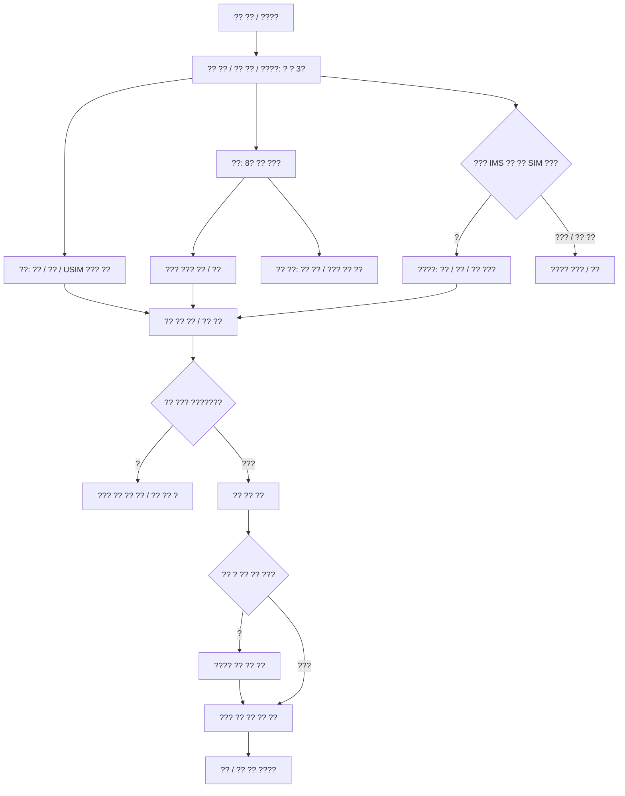

# ?? ??? ?? ??

???: 2026-10-08. main? ????? ?????. ?? ??? ??? ?? ?? ????? ?? ??? ? ????.

?? ?? ??? **?? ?? | ?? ?? | ????**???. USIM ???? ??? ??? ??? ?? ??/??? ??? ?? ??? ????. ? ?? ?????? VoLTE? ???? ??? ?? Newflasher ???? ???? ???. ????? ??/???? ?? ?? ???? **?? ?? ??** ?????.

## ?? ??? ??

`domain/workflow.ts`? `updateProblem()/manualTaskProblem()`? ??? ?? ??? ?????. ??/?? ?? ??? ?? ??????? Android ?? ? ?? 3??? ???? ?? ???? ? ??? ?????. ????? ????? ??? ??? ??? ?????. ??? ?? ? ?? ??? ??? ????.

| ?? | ?? / ?? ?? |
|---|---|
| ?? ?? | USIM ?? ? ??? ????? ????? ? EFS ??????VoLTE ?? ? ??? ???/?? ? ???? ?? ?? ??? ?? ? ?? ?? |
| ?? / ?? | Android ??. ??? ?? ?? ??, ??? ?? ??? ??? ?? ?? |
| ?? | ?? ?? ???? ??? locked ??. ????? ????? ?? ?? |
| ?? | ?? ?? ???? ??? unlocked ??. ?? ??? ???? ?? ? ?? ????? ?????? ?? ?? |
| ?? | ?? unlocked???? ??. ?? ?? ?? ??? ??? Magisk ?? |
| ??? | ?? unlocked??? ??. ?? ?? ?? ??? ??? ? ?? ?? |
| ?? VoLTE ?? | ?? unlocked??? ??. ?? SIM ???????? ??. ?? ??/??/???/??/????? ???? ?? |
| ?? ?? | ??? SIM. IMS ??? ?? ?? ??? ??, ???/?? ?? |
| ???? | `cellularReady()`? SIM ?? ??. Wi-Fi? ????????? ??? ?? |

`buildPlan()` ??? ????? ??? ?????. `opts.mode/manualTask`? ???? ?? ?? ? SIM/???/?? ???? ????????? ?? ??? ??????. ?? ??? ?? ???? ?? ???? ??? ?????. ?? ??? ??? ??? ????????? ????.

?? ??? ??? ??? ??????. ?? manifest? ????? ????? ?? ???? ?? ??? ?????. ?? ?? ??? ???? ?????? ?? ?? ????. ?? ??? [??/??](backup-restore.md)? ????.

## ?? ??? ??

? ??? `stepDone()`? ?? ??? ?? `awaitingNext`? ????. ??? ??? ???? ?? ???? ?? ?? ? ?? ??? ????. ?? ????? ????? ????? ?? ? ?? ????? ??? ?? ?????.

?? ??? ?? ??? `finally` ??? ?? ? ??? ?? ? ?????. ?? ??????????? ??? ???? ?? ? ?? ??? ?? ??? ???? ?? ???. ?? ???? PC ??? ?????.

??? optional `opts.mode/manualTask`? ?????. ?? ??? ??/?? ????? ??? ??? ???? ?? ???? ????. ?? `awaitingNext`? ??? ??? ?????. ?? ??? ??? ?? ?? ?? ??? ??? ???? ????? ?? ???? ???? ????.

## ???? ?? ??

???????? ????? ?? ????? ?? ?????? ?????. ?? SIM/??? ??? ???? ??(?? ?), ?? ??? ??, Newflasher ??, ??/?? ??, ?? ??? ?????. ???DSP?TA???? ??? ??? ?? ???? ??? ??? ????.

?? ????????Sony Flash mode ??? ?? ??? ?? ?? ??? ?????? ?? ??? ??? ??? ?????. ?? ??? ?? ???? ?? ??? ??? ????. ?? ??? [???](firmware.md), ?? ??? [?? ??](../../.plans/04-engine/workflow-modes-20261007.md)? ????.

??? `routes/+page.svelte`, ??/??? `wizard.svelte.ts`, ??? `domain/plan.ts`, ?? ?? ??? `domain/execution.ts`, ?? ???? `data/devices.ts`? ?????. ?? ???/Cargo ?? ??? ????? ??? ??? ???? ?????.
