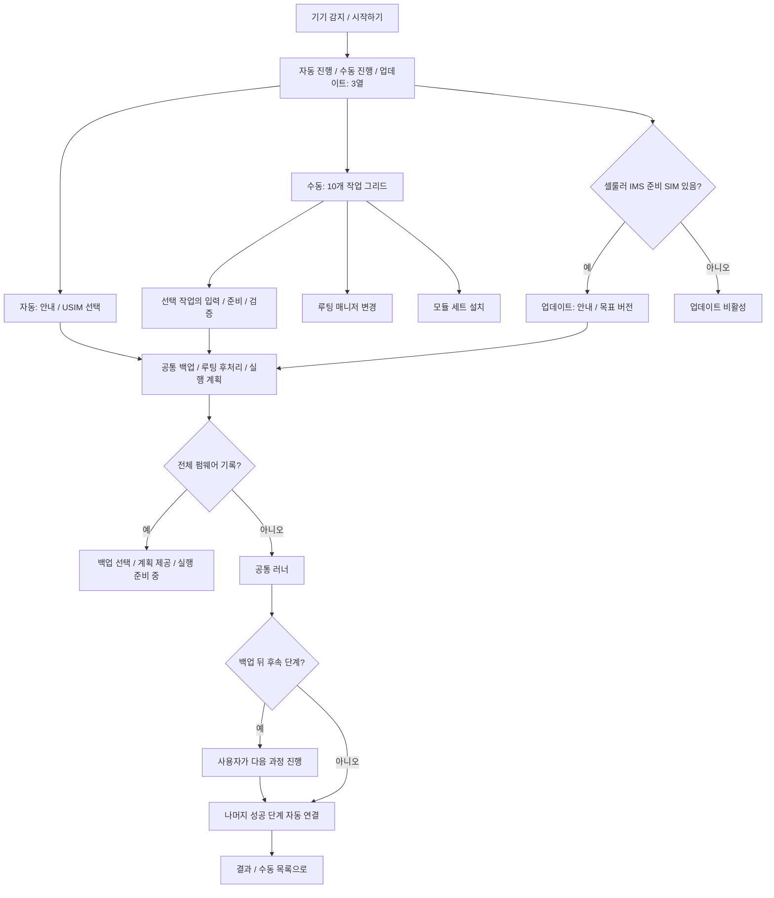

# 작업 흐름과 실행 계획

기준일: 2026-10-08. main의 구현 범위입니다. 새 기능은 오프라인 검증 단계이며 실제 전체 펌웨어 기록은 차단합니다.

시작 카드 순서는 **자동 진행 | 수동 진행 | 업데이트**이며 한 행에 배치합니다. USIM 화면에는 통신사 선택만 남습니다. 새 버전 조회·선택은 VoLTE가 인식되는 기기의 전용 Newflasher 업데이트 경로에만 있습니다. 자동·수동의 순정 부트 이미지 준비는 현재 설치 버전 기준입니다.

## 조건과 계획

카드와 계획은 `domain/workflow.ts`의 조건을 공유합니다. 선택 화면은 같은 모델·시리얼의 승인된 Android 한 대를 3초마다 조회하며 클릭 직전에도 새 결과를 기다립니다. 연결 실패·교체·불명확한 필수 상태는 비활성 사유로 표시합니다. 화면을 떠난 뒤 늦은 결과는 버립니다.

| 경로 | 조건과 포함 작업 |
|---|---|
| 자동 | 선택 SIM에 필요한 언락·초기 설정·루팅·EFS 적용/검증·VoLTE 설정, 선택한 후처리, 초기화가 있을 때만 자동 복구, 최종 확인 |
| 백업 / 복구 | Android 연결. 복구는 기존 폴더의 완결·기기 키·해시를 검증하고 쓰기 직전에 재검증 |
| 언락 | 지원 파티션 + locked. 조건·코드·초기 설정 포함 |
| 리락 | 지원 파티션 + unlocked. 루트 감지와 무관하게 순정 양 슬롯 복원·리락 게이트 포함 |
| 루팅 / 언루팅 | 지원 unlocked 기기에서 각각 비루팅 / 루팅 상태 |
| 수동 VoLTE 패치 | 지원 unlocked + rooted. 별도 언락/루팅/언루팅/리락/업데이트를 추가하지 않음 |
| 통신 확인 | 인식된 SIM. 읽기 진단과 사용자 통화 체크 |
| 루팅 매니저 변경 | 지원 unlocked + rooted. 기존 전환 엔진 재사용, 모듈·엔진 설정 정리 안내 |
| 루팅 모듈 설치 | unlocked + rooted. A/B 세트와 의존성·엔진별 순서 사용 |
| 업데이트 | `cellularReady()` SIM 하나 이상. Wi-Fi만 등록·진단 실패/모순은 불가 |

미리보기와 러너는 `buildPlan()`을 공유하고 `opts.mode/manualTask`로 분리합니다. 경로 변경은 SIM/펌웨어/후처리/이전 백업 입력을 정리합니다. 자동은 남은 새 펌웨어·단독 부트로더 값을 무시하고 수동은 선택 작업과 필요한 준비·검증만 포함합니다.

## 루팅 유지 모듈

자동 옵션의 루팅 탭 아래 **루팅 유지 시**에서 모듈 세트를 고릅니다. B(감지 회피)는 A(기초)에 의존해 자동 선택되며 B가 선택된 동안 A만 해제할 수 없습니다. 언루팅·리락 또는 언락/초기화가 포함되는 상태에서는 세트 선택을 해제하고 비활성화합니다. 자동은 매니저를 바꾸지 않으며 실제 엔진 감지 후 해당 모듈 순서를 적용합니다.

설치 단계는 VoLTE 설정 후 최종 확인 전에 추가합니다. 모듈별 설치·재부팅·적용 확인과 실제 폰 설정 안내를 수행합니다. 모의 성공으로 처리하지 않으며 기본 쓰기 게이트가 꺼진 빌드에서는 실행을 차단합니다. 상세 구성은 [루트 도구](root-tools.md)에 있습니다.

## 완료·재개

일반 다음 버튼 대기는 백업 뒤에만 남습니다. 백업이 마지막이면 완료하고 생략 시 대기도 없습니다. 권한·초기 설정·폰 연결·통화·모듈 설정·누락 안내·실패 대기는 유지합니다. 다음 단계는 이전 엔진의 finally 정리와 진행 중 I/O가 끝난 뒤 시작하고 세대·커서·취소/오류를 재확인합니다.

기록은 optional mode/manualTask/modules를 저장합니다. 구형 기록은 백업/부트로더 입력으로 경로를 복원하며 자동 재생하지 않습니다. 기존 awaitingNext를 복원하고 전체 fw-flash가 남은 기록도 실행/모의 성공을 차단합니다.

업데이트는 안내·동의·버전·공통 백업 선택·보존 계획을 제공합니다. 언락/리락/재패치/자동 복구를 넣지 않습니다. 전체 취득·기기별 기록·목표 이미지 루팅 유지 연결은 미완성이므로 실행을 차단합니다. 무손실·VoLTE 보존 보장이 아닙니다. [펌웨어](firmware.md)와 [분기 계획](../../.plans/04-engine/workflow-modes-20261007.md)을 참조하세요.
