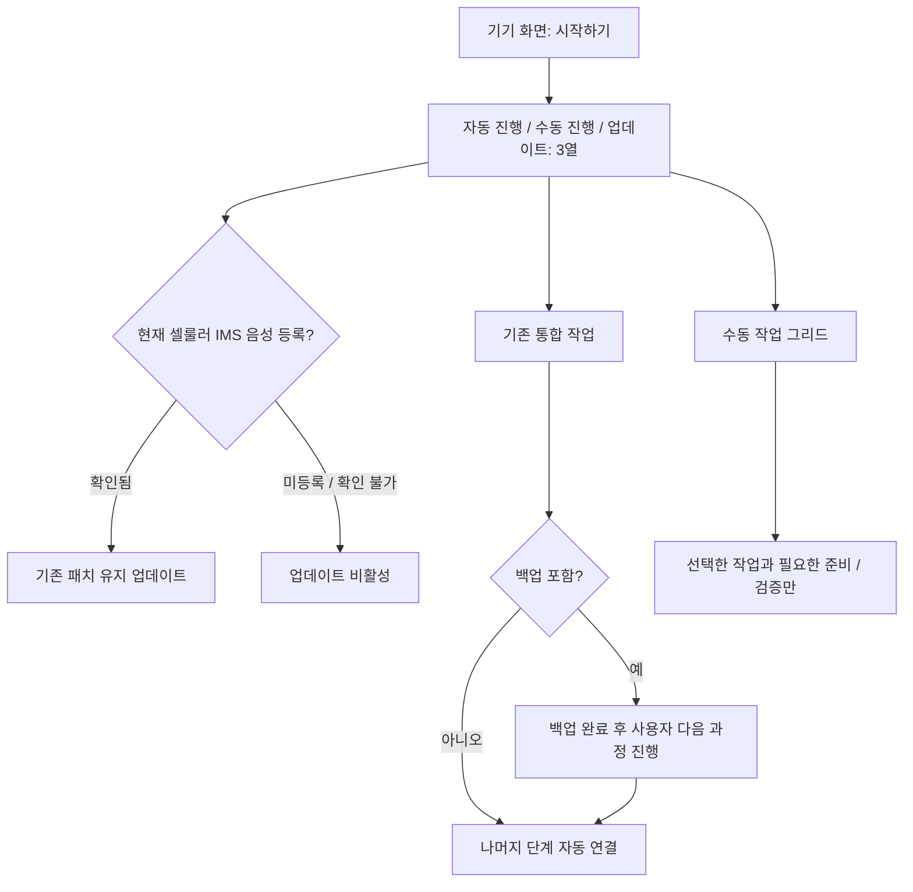

# 작업 흐름과 실행 계획

기준일: 2026-10-07. 현재 화면과 요청된 새 분기를 구분합니다.

## 현재 화면

`domain/plan.ts`의 `buildPlan()` 결과를 계획 미리보기와 실제 러너가 함께 사용합니다. 표시용 순서와 실행용 순서를 따로 작성하지 않습니다.

## 조건별 계획

| 입력/기기 상태 | 결과 |
|---|---|
| SIM 통신사 하나 이상 선택 | 해당 슬롯의 EFS 적용·검증·VoLTE 설정 포함 |
| 패치 선택 + 부트로더 locked | 언락과 초기 설정 포함 |
| 패치 선택 + 이미 rooted | 업데이트가 없으면 루팅 생략 가능 |
| 새 펌웨어 + 패치 선택 | 모뎀/DSP 포함 업데이트 후 다시 루팅·패치 |
| 새 펌웨어 + 패치 선택 없음 | 모뎀/DSP 제외, 언락/EFS/리락 생략. 기존 루팅은 재적용 계획 |
| 리락 선택 | 언루팅/순정 복원 포함, 초기화 후 연결 준비 포함 |
| 복구 선택 | 통합 계획에서 초기화가 있고 백업을 선택했을 때 포함 |
| 단독 언락/리락 | 패치·새 펌웨어 선택이 없고 부트로더 상태가 맞을 때 |

현재 `stepDone()`은 각 단계 완료 뒤 `awaitingNext`로 멈추며 [다음]을 요구합니다. 수동 모달의 권한·연결 확인 대기는 이 일반 단계 대기와 별도입니다. `domain/execution.ts`는 실전 계획에 미구현 전체 펌웨어 기록이나 모의 기기 단계가 섞이면 시작을 차단합니다.

## 요청된 분기 — 미구현 계획

- 시작 직후 3열 카드 페이지를 넣고 USIM 화면의 단독 언락/리락 카드를 제거합니다.
- 자동 진행은 기존 작업 내용 유지, 백업 뒤 일반 대기만 남기고 성공한 나머지 단계는 자동 전환합니다. 폰 권한 승인·초기 설정·실제 통화처럼 사람이 해야 할 행동은 남습니다.
- 수동 진행은 백업, 복구, 언락, 리락, 루팅, 언루팅, VoLTE 패치, 통신 확인의 그리드입니다. 상태가 맞지 않으면 비활성화합니다. 선택하지 않은 후속 작업은 추가하지 않습니다.
- 업데이트는 활성 SIM 하나 이상을 `cellularReady()`로 확인하고, 모뎀/DSP/TA/사용자 데이터를 보존하는 전용 계획을 사용합니다. SIM 선택으로 재패치가 끼어들지 않게 작업 종류를 명시적으로 저장합니다.
- 수동 복구는 통합 계획의 초기화 조건과 분리합니다. 리락은 준비 단계부터 순정 복원 게이트를 재사용합니다.

구현 범위·카드 조건·재개·검증 기준은 [분기 계획](../../.plans/04-engine/workflow-modes-20261007.md)에 있습니다. 이 계획으로 실행 플래그나 쓰기 feature가 활성화된 것은 아닙니다.

화면 전이는 `routes/+page.svelte`, 선택·실행 상태는 `wizard.svelte.ts`, 순서/조건은 `domain/plan.ts`, 실전 조합은 `domain/execution.ts`를 함께 확인합니다. 기종 조건은 [기기 문서](../devices.md)의 표와 코드 `data/devices.ts`를 맞춥니다.
